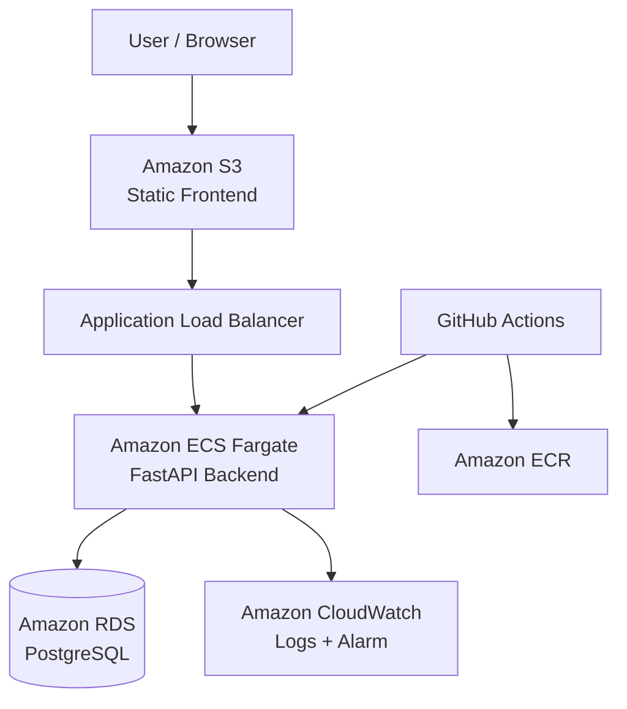

Cloud / DevOps Engineer Technical Assessment
This repository contains a complete AWS-based implementation of a simple three-tier web application deployed using Infrastructure as Code, containerization, CI/CD, managed database services, monitoring, and security best practices.
The application is intentionally simple because the focus of this assessment is the infrastructure and automation around the application rather than application complexity.
Overview
The application consists of three tiers:
- Frontend: Static HTML / JavaScript application
- Backend: Python FastAPI REST API
- Database: PostgreSQL
The cloud infrastructure is provisioned using Terraform and deployed on AWS.
The backend is containerized with Docker and runs on Amazon ECS Fargate.
The frontend is hosted using Amazon S3 Static Website Hosting.
The database runs on Amazon RDS PostgreSQL.
GitHub Actions provides CI/CD and automatically builds, tests, pushes, and deploys the backend whenever changes are pushed to the main branch.
Architecture

Application Request Flow
Browser
   |
   v
Amazon S3 Static Website
   |
   v
Application Load Balancer
   |
   v
Amazon ECS Fargate
   |
   v
FastAPI Backend
   |
   v
Amazon RDS PostgreSQL
CI/CD Flow
Push to main
     |
     v
GitHub Actions
     |
     +--> Run Tests
     |
     +--> Build Docker Image
     |
     +--> Authenticate to AWS using OIDC
     |
     +--> Push Image to Amazon ECR
     |
     +--> Update ECS Task Definition
     |
     +--> Deploy to ECS
Technology Stack
Area	Technology
Cloud Provider	AWS
Infrastructure as Code	Terraform
Frontend	HTML / JavaScript
Frontend Hosting	Amazon S3 Static Website
Backend	Python FastAPI
Database	PostgreSQL
Managed Database	Amazon RDS
Containerization	Docker
Compute	Amazon ECS Fargate
Load Balancer	Application Load Balancer
Container Registry	Amazon ECR
CI/CD	GitHub Actions
AWS Authentication	GitHub OIDC
Logging	Amazon CloudWatch Logs
Monitoring	Amazon CloudWatch
Alerting	CloudWatch CPU Alarm

Why AWS?
AWS was selected because it provides managed services for all required parts of the architecture and integrates well with Terraform, Docker, and GitHub Actions.
The design uses managed services where possible to reduce operational overhead:
- ECS Fargate avoids managing EC2 worker nodes.
- RDS provides managed PostgreSQL.
- ECR provides a private Docker registry.
- ALB provides traffic routing and health checks.
- CloudWatch provides centralized logging and monitoring.
- S3 provides simple and cost-effective static frontend hosting.
Repository Structure
.
├── backend/
│   ├── app.py
│   ├── Dockerfile
│   ├── requirements.txt
│   ├── test_app.py
│   └── .dockerignore
│
├── frontend/
│   └── index.html
│
├── terraform/
│   ├── bootstrap/
│   │   ├── main.tf
│   │   ├── outputs.tf
│   │   ├── providers.tf
│   │   └── variables.tf
│   │
│   ├── environments/
│   │   └── assessment/
│   │       ├── backend.tf
│   │       ├── main.tf
│   │       ├── outputs.tf
│   │       ├── providers.tf
│   │       ├── variables.tf
│   │       └── terraform.tfvars.example
│   │
│   └── modules/
│       ├── network/
│       ├── ecr/
│       ├── ecs/
│       ├── rds/
│       ├── frontend/
│       ├── monitoring/
│       └── cicd/
│
├── .github/
│   └── workflows/
│       └── ci.yml
│
├── docker-compose.yml
├── .gitignore
└── README.md
Terraform is organized into reusable modules instead of placing the complete implementation in a single file.
Running Locally
Prerequisites
Install:
- Git
- Docker
- Docker Compose
Clone the repository:
git clone https://github.com/ahmedrabe33/cloud-devops-assessment.git
cd cloud-devops-assessment
Run Backend and PostgreSQL
docker compose up --build
Backend:
http://localhost:8000
Health check:
curl http://localhost:8000/health
Database check:
curl http://localhost:8000/db-check
Run Frontend Locally
cd frontend
python3 -m http.server 8080
Open:
http://localhost:8080
Docker Implementation
The backend uses a multi-stage Docker build.
Implemented best practices:
- Multi-stage build
- Slim Python base image
- Non-root user
- Reduced build context with .dockerignore
- Only port 8000 exposed
- Dependencies installed separately from application code
Infrastructure as Code
Terraform provisions:
- VPC
- Two public subnets
- Two private subnets
- Internet Gateway
- NAT Gateway
- Public/private route tables
- Application Load Balancer
- ECS Cluster
- ECS Service
- ECS Task Definition
- ECR Repository
- RDS PostgreSQL
- S3 frontend bucket
- IAM roles and policies
- GitHub OIDC provider
- Security groups
- CloudWatch log group
- CloudWatch alarm
Networking
Public subnets contain:
- Application Load Balancer
- NAT Gateway
Private subnets contain:
- ECS Fargate tasks
- RDS PostgreSQL
ECS tasks do not receive public IP addresses.
RDS is not publicly accessible.
Traffic flow:
Internet
   |
   | TCP 80
   v
ALB
   |
   | TCP 8000
   v
ECS
   |
   | TCP 5432
   v
RDS
Terraform Remote State
Terraform state is stored remotely in Amazon S3.
terraform {
  backend "s3" {
    bucket       = "cloud-devops-assessment-771675725500-tfstate"
    key          = "assessment/terraform.tfstate"
    region       = "us-east-1"
    encrypt      = true
    use_lockfile = true
  }
}
Benefits:
- Centralized state
- State locking
- Encryption at rest
- Protection against concurrent operations
The backend bucket is managed separately in terraform/bootstrap.
AWS Deployment
Verify AWS access:
aws sts get-caller-identity
Set the database password:
export TF_VAR_db_password='YOUR_STRONG_PASSWORD'
Initialize Terraform:
cd terraform/environments/assessment
terraform init
Validate:
terraform fmt -recursive
terraform validate
Review:
terraform plan
Deploy:
terraform apply
Useful outputs:
terraform output
Examples:
alb_dns_name
db_endpoint
ecr_repository_url
ecs_cluster_name
ecs_service_name
frontend_website_url
github_actions_role_arn
Frontend Deployment
Terraform uploads frontend/index.html automatically to Amazon S3.
The frontend contains:
__API_URL__
Terraform replaces this placeholder with the ALB DNS name during deployment.
This avoids manually changing the frontend after infrastructure creation.
CI/CD Pipeline
GitHub Actions runs automatically on pushes to main.
Pipeline stages:
1. Checkout repository
2. Install dependencies
3. Run tests
4. Build Docker image
5. Authenticate to AWS using OIDC
6. Login to Amazon ECR
7. Push Docker image
8. Update ECS task definition
9. Deploy ECS service
Flow:
Build -> Test -> Build Docker Image -> Deploy
GitHub OIDC
GitHub Actions authenticates to AWS using OIDC.
No long-lived AWS access keys are stored in GitHub.
Terraform creates:
- IAM OIDC provider
- GitHub Actions role
- Deployment policy
GitHub stores only:
AWS_ROLE_ARN
Temporary credentials are obtained using:
sts:AssumeRoleWithWebIdentity
Security
Security measures include:
- ECS tasks in private subnets
- RDS in private subnets
- RDS public access disabled
- ECS without public IP
- ALB as the only public backend entry point
- Port 8000 accessible only from ALB
- Port 5432 accessible only from ECS
- Separate IAM roles
- Restricted GitHub Actions permissions
- RDS encryption
- S3 encryption
- ECR encryption
- Terraform state encryption
Amazon ECR
The backend image is stored in Amazon ECR.
The repository uses:
- Image scanning on push
- AES256 encryption
Images are pushed automatically by GitHub Actions.
ECS Fargate
ECS Fargate was selected to avoid managing EC2 instances.
Advantages:
- No operating system maintenance
- No worker-node management
- Native ECR integration
- Native ALB integration
- Native IAM integration
- Native CloudWatch integration
Amazon RDS
The database uses PostgreSQL 16 on Amazon RDS.
Configuration includes:
- db.t3.micro
- 20 GB GP3
- Private networking
- Encryption enabled
- Single-AZ
- Automated backup retention
- Public access disabled
Monitoring and Logging
Amazon CloudWatch is used for logging and monitoring.
Logging
ECS logs are sent to:
/ecs/cloud-devops-assessment-assessment
using the awslogs driver.
Monitoring
A CloudWatch alarm monitors ECS CPU utilization.
Example:
CPUUtilization > 80%
Architectural Decisions
ECS Fargate Instead of EC2
Fargate was selected to reduce infrastructure management.
Trade-off:
Fargate may cost more than optimized EC2 workloads at large scale.
RDS Instead of Self-Managed PostgreSQL
RDS was selected because it provides a managed database with backups, encryption, and reduced maintenance.
Private ECS and RDS
ECS tasks and RDS are placed in private subnets to reduce public exposure.
Single NAT Gateway
One NAT Gateway is used to reduce assessment cost.
Trade-off:
This creates an Availability Zone dependency.
For production, one NAT Gateway per Availability Zone would improve availability.
Frontend Hosting Decision
The frontend is hosted using S3 Static Website Hosting.
CloudFront was initially considered to provide:
- HTTPS
- CDN caching
- Global distribution
- Private S3 origin access
However, the AWS account returned:
AccessDenied: Your account must be verified before you can add new CloudFront resources.
Because CloudFront was not an explicit requirement of the assessment, S3 Static Website Hosting was used as a temporary alternative.
For production, CloudFront would be placed in front of S3 and HTTPS would be enforced.
Trade-offs
Main assessment trade-offs:
- One NAT Gateway
- One ECS task
- Single-AZ RDS
- S3 static website instead of CloudFront
- HTTP instead of custom-domain HTTPS
- Basic monitoring rather than a complete observability platform
- Small resource sizes to reduce cloud cost
These choices keep the assessment environment simple, repeatable, and cost-efficient.
Production Considerations
For production, the ECS service would run multiple tasks across multiple Availability Zones and use ECS Service Auto Scaling.
RDS would use Multi-AZ deployment, stronger backup retention, deletion protection, and possibly read replicas.
The frontend would use CloudFront with a private S3 origin and HTTPS through AWS Certificate Manager.
One NAT Gateway per Availability Zone would improve high availability.
Monitoring would be expanded to include:
- ALB 5xx errors
- Response latency
- Unhealthy targets
- ECS task failures
- ECS memory usage
- RDS CPU
- RDS connections
- RDS storage
Secrets would be stored in AWS Secrets Manager or Systems Manager Parameter Store.
Cost controls would include:
- ECS right-sizing
- Auto Scaling
- Database right-sizing
- AWS Budgets
- Cost Explorer
- Log retention policies
- Removal of unused resources
Successful Validation
The deployed application was tested successfully.
The frontend showed:
Frontend: Running
Backend API: Healthy
Database: Connected
The following were verified:
- Frontend loaded from S3
- ALB routed traffic to ECS
- ECS health endpoint worked
- Backend connected to RDS
- User insertion worked
- User retrieval worked
- GitHub Actions tests passed
- Docker image was built
- Docker image was pushed to ECR
- ECS deployment completed successfully
- Terraform created the environment
- Terraform destroyed the environment after validation
Useful Commands
Backend health:
curl http://<ALB-DNS>/health
Database connectivity:
curl http://<ALB-DNS>/db-check
Get users:
curl http://<ALB-DNS>/users
Create user:
curl -X POST \
  http://<ALB-DNS>/users \
  -H "Content-Type: application/json" \
  -d '{"name":"Ahmed Rabie","age":26}'
CloudWatch logs:
aws logs tail \
  "/ecs/cloud-devops-assessment-assessment" \
  --since 10m \
  --region us-east-1
Cleanup
To destroy the assessment infrastructure:
cd terraform/environments/assessment
terraform destroy
The remote-state S3 bucket is managed separately through terraform/bootstrap.
The environment was destroyed after successful validation to avoid unnecessary AWS charges.
Screenshots / Evidence
Suggested evidence for submission:
1. Running frontend
2. Backend Healthy
3. Database Connected
4. Registered users
5. Successful GitHub Actions pipeline
6. ECS running task
7. ECR image
8. CloudWatch Logs
9. CloudWatch Alarm
10. Terraform apply/destroy output
Notes
The environment was deployed in a personal AWS account and destroyed after testing to minimize cloud costs.
The application is intentionally simple because the assessment focuses on cloud infrastructure, automation, CI/CD, security, containerization, monitoring, and documentation.
