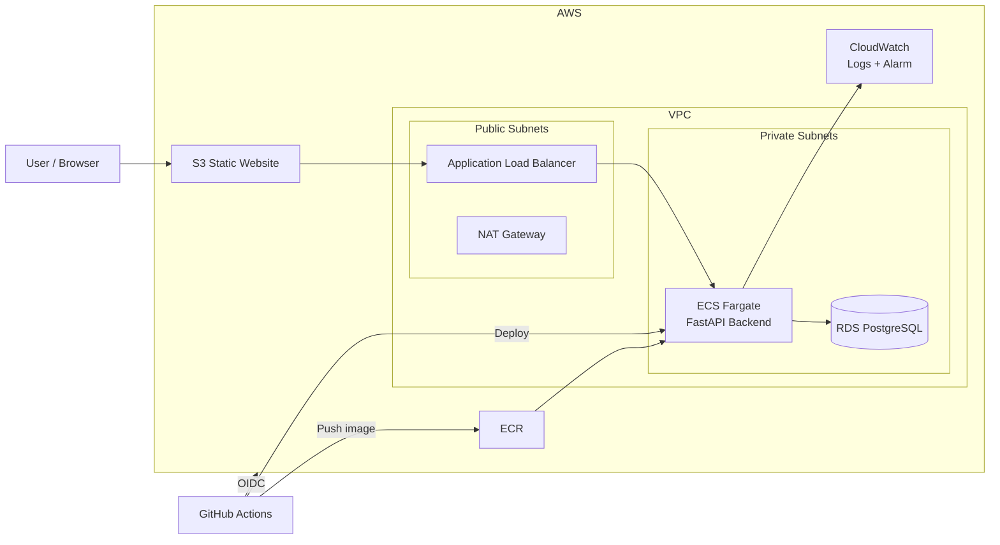

# Cloud / DevOps Engineer Technical Assessment

A reproducible AWS deployment of a simple three-tier web application using **Terraform**, **Docker**, **Amazon ECS Fargate**, **Amazon RDS PostgreSQL**, **Amazon S3**, **Amazon ECR**, **Amazon CloudWatch**, and **GitHub Actions**.

The application itself is intentionally simple. The main focus is the DevOps implementation: Infrastructure as Code, containerization, CI/CD, networking, security, monitoring, repeatability, and documentation.

---

## Table of Contents

- [Architecture](#architecture)
- [Technology Stack](#technology-stack)
- [Repository Structure](#repository-structure)
- [Prerequisites](#prerequisites)
- [Clone the Repository](#clone-the-repository)
- [Run Locally](#run-locally)
- [Reset Local Environment](#reset-local-environment)
- [Deploy to AWS from Zero](#deploy-to-aws-from-zero)
- [CI/CD](#cicd)
- [Security](#security)
- [Monitoring and Logging](#monitoring-and-logging)
- [Architecture Decisions](#architecture-decisions)
- [Trade-offs](#trade-offs)
- [Production Considerations](#production-considerations)
- [Verification](#verification)
- [Cleanup](#cleanup)
- [Troubleshooting](#troubleshooting)
- [Assessment Coverage](#assessment-coverage)

---

# Architecture



## Application Traffic

```text
Browser
   |
   +--> Amazon S3 Static Website
                |
                v
      Application Load Balancer
                |
                v
          ECS Fargate
          FastAPI :8000
                |
                v
       RDS PostgreSQL :5432
```

## CI/CD Flow

```text
Push to main
    |
    v
GitHub Actions
    |
    +--> Install dependencies
    +--> Run tests
    +--> Build Docker image
    +--> Authenticate to AWS using OIDC
    +--> Push image to ECR
    +--> Register new ECS task definition
    +--> Update ECS service
```

---

# Technology Stack

| Area | Technology |
|---|---|
| Cloud | AWS |
| Infrastructure as Code | Terraform |
| Frontend | HTML / JavaScript |
| Frontend Hosting | Amazon S3 Static Website |
| Backend | Python FastAPI |
| Database | PostgreSQL |
| Managed Database | Amazon RDS |
| Containers | Docker |
| Compute | Amazon ECS Fargate |
| Load Balancing | Application Load Balancer |
| Container Registry | Amazon ECR |
| CI/CD | GitHub Actions |
| GitHub → AWS Authentication | OpenID Connect (OIDC) |
| Logs | Amazon CloudWatch Logs |
| Monitoring / Alerting | Amazon CloudWatch |

---

# Why AWS?

AWS was selected because it provides managed services for all required layers and integrates well with Terraform and GitHub Actions.

Managed services used in the solution:

- **ECS Fargate** avoids managing EC2 worker nodes.
- **RDS PostgreSQL** provides a managed relational database.
- **ECR** provides a private container registry.
- **ALB** provides traffic routing and health checks.
- **CloudWatch** provides centralized logging and monitoring.
- **S3** provides simple, low-cost static frontend hosting.

---

# Repository Structure

```text
.
├── .github/
│   └── workflows/
│       └── ci.yml
│
├── backend/
│   ├── app.py
│   ├── Dockerfile
│   ├── requirements.txt
│   ├── test_app.py
│   └── .dockerignore
│
├── frontend/
│   └── index.html
│
├── terraform/
│   ├── bootstrap/
│   │   ├── main.tf
│   │   ├── outputs.tf
│   │   ├── providers.tf
│   │   └── variables.tf
│   │
│   ├── environments/
│   │   └── assessment/
│   │       ├── backend.tf
│   │       ├── main.tf
│   │       ├── outputs.tf
│   │       ├── providers.tf
│   │       ├── variables.tf
│   │       └── terraform.tfvars.example
│   │
│   └── modules/
│       ├── cicd/
│       ├── ecr/
│       ├── ecs/
│       ├── frontend/
│       ├── monitoring/
│       ├── network/
│       └── rds/
│
├── docker-compose.yml
├── .gitignore
└── README.md
```

Terraform is split into reusable modules instead of placing the entire infrastructure in a single file.

---

# Prerequisites

Install:

- Git
- Docker
- Docker Compose
- Terraform
- AWS CLI
- An AWS account
- A GitHub account

Verify:

```bash
git --version
docker --version
docker compose version
terraform version
aws --version
```

---

# Clone the Repository

Clone the repository from **any directory**:

```bash
git clone https://github.com/ahmedrabe33/cloud-devops-assessment.git
```

Enter the cloned repository:

```bash
cd cloud-devops-assessment
```

> The repository can be cloned inside any parent directory. The instructions below do not depend on `~/cloud-devops-assessment`.

Set a reusable variable that always points to the Git repository root:

```bash
REPO_ROOT="$(git rev-parse --show-toplevel)"
```

Return to the repository root at any time with:

```bash
cd "$REPO_ROOT"
```

If you open a new terminal inside any subdirectory of this repository, recreate the variable with:

```bash
REPO_ROOT="$(git rev-parse --show-toplevel)"
```

---

# Run Locally

The local environment uses Docker Compose to run:

- FastAPI backend
- PostgreSQL database

Start from the repository root:

```bash
REPO_ROOT="$(git rev-parse --show-toplevel)"
cd "$REPO_ROOT"
```

## 1. Start Backend and Database

```bash
docker compose up --build
```

The backend will be available at:

```text
http://localhost:8000
```

Useful endpoints:

```text
GET  /
GET  /health
GET  /db-check
GET  /users
POST /users
```

Open another terminal for the following tests.

Test the backend:

```bash
curl http://localhost:8000/health
```

Expected response:

```json
{"status":"healthy"}
```

Test database connectivity:

```bash
curl http://localhost:8000/db-check
```

## 2. Test the API

Create a user:

```bash
curl -X POST \
  http://localhost:8000/users \
  -H "Content-Type: application/json" \
  -d '{"name":"Test User","age":25}'
```

List users:

```bash
curl http://localhost:8000/users
```

## 3. Run Frontend Locally

The cloud frontend source contains:

```text
__API_URL__
```

Terraform replaces it with the ALB URL during cloud deployment.

For local testing, create a temporary copy that points to the local backend:

```bash
REPO_ROOT="$(git rev-parse --show-toplevel)"
sed 's|__API_URL__|http://localhost:8000|g' \
  "$REPO_ROOT/frontend/index.html" > /tmp/index.html
```

Start a simple local web server:

```bash
cd /tmp
python3 -m http.server 8080
```

Open:

```text
http://localhost:8080
```

## 4. Stop Local Environment

Stop the frontend server with:

```text
Ctrl + C
```

Return to the Git repository root without assuming where the repository was cloned:

```bash
cd "$REPO_ROOT"
```

If `REPO_ROOT` is not available in the current terminal:

```bash
cd -
REPO_ROOT="$(git rev-parse --show-toplevel)"
cd "$REPO_ROOT"
```

Stop Docker Compose:

```bash
docker compose down
```

---

# Reset Local Environment

To completely remove local containers, Docker Compose networks, and PostgreSQL data:

```bash
REPO_ROOT="$(git rev-parse --show-toplevel)"
cd "$REPO_ROOT"

docker compose down -v --remove-orphans
```

Optional cleanup of the manually built backend image:

```bash
docker image rm cloud-devops-backend 2>/dev/null || true
```

Start again from a clean local state:

```bash
docker compose up --build
```

---

# Docker Implementation

The backend uses a multi-stage Dockerfile.

Implemented practices include:

- Multi-stage build
- `python:3.12-slim`
- Dependencies separated from application code
- Non-root runtime user
- `.dockerignore`
- Minimal runtime image
- Port `8000`

Manual build:

```bash
REPO_ROOT="$(git rev-parse --show-toplevel)"
cd "$REPO_ROOT"

docker build -t cloud-devops-backend ./backend
```

---

# Deploy to AWS from Zero

This section describes a fresh deployment for a new user or a clean AWS environment.

> AWS resources such as NAT Gateway, Application Load Balancer, ECS Fargate, and RDS may generate charges. Destroy the environment after testing when it is no longer required.

Start from the repository:

```bash
REPO_ROOT="$(git rev-parse --show-toplevel)"
cd "$REPO_ROOT"
```

---

## Step 1 — Configure AWS CLI

Configure AWS credentials for your own account:

```bash
aws configure
```

Verify authentication:

```bash
aws sts get-caller-identity
```

Do not commit AWS access keys or secret access keys to Git.

---

## Step 2 — Create Terraform Remote State

Go to the bootstrap directory:

```bash
cd "$REPO_ROOT/terraform/bootstrap"
```

Initialize:

```bash
terraform init
```

Format and validate:

```bash
terraform fmt
terraform validate
```

Review:

```bash
terraform plan
```

Create the state resources:

```bash
terraform apply
```

Confirm with:

```text
yes
```

View the outputs:

```bash
terraform output
```

The bootstrap configuration creates the S3 bucket used for Terraform remote state.

### Configure the backend bucket

Open:

```text
terraform/environments/assessment/backend.tf
```

and set the bucket name to the bucket created by the bootstrap step.

Example:

```hcl
terraform {
  backend "s3" {
    bucket       = "YOUR-TERRAFORM-STATE-BUCKET"
    key          = "assessment/terraform.tfstate"
    region       = "us-east-1"
    encrypt      = true
    use_lockfile = true
  }
}
```

S3 bucket names are globally unique, so another AWS account must use its own bucket name.

---

## Step 3 — Configure Assessment Variables

Go to the assessment environment:

```bash
cd "$REPO_ROOT/terraform/environments/assessment"
```

Review:

```bash
cat terraform.tfvars.example
```

Create a local variables file if needed:

```bash
cp terraform.tfvars.example terraform.tfvars
```

Update environment-specific values such as:

```text
AWS region
GitHub owner
GitHub repository
```

Do not store the database password in a committed `.tfvars` file.

Export it instead:

```bash
export TF_VAR_db_password='CHANGE_ME_TO_A_STRONG_PASSWORD'
```

---

## Step 4 — Initialize the Assessment Environment

```bash
terraform init -reconfigure
```

Format and validate:

```bash
terraform fmt -recursive
terraform validate
```

---

## Step 5 — Set ECS Desired Count to 0 for the First Deployment

On a completely fresh deployment, ECR does not contain a backend image yet.

Set the ECS module default desired count to `0` before the first apply:

```bash
cd "$REPO_ROOT"
```

```bash
sed -i 's/default = 1/default = 0/' terraform/modules/ecs/variables.tf
```

Verify:

```bash
grep -n "default = " terraform/modules/ecs/variables.tf
```

Return to the assessment environment:

```bash
cd "$REPO_ROOT/terraform/environments/assessment"
```

Review the plan:

```bash
terraform plan
```

Create the infrastructure:

```bash
terraform apply
```

Confirm:

```text
yes
```

View outputs:

```bash
terraform output
```

At this point the AWS infrastructure exists, but the ECS service has no running backend task yet.

---

# CI/CD

GitHub Actions runs automatically when changes are pushed to `main`.

Pipeline:

```text
Build
  |
  v
Test
  |
  v
Build Docker Image
  |
  v
Push to ECR
  |
  v
Deploy to ECS
```

---

## Step 6 — Configure GitHub OIDC

Terraform creates the GitHub Actions IAM role.

From the assessment directory:

```bash
cd "$REPO_ROOT/terraform/environments/assessment"
```

Get the role ARN:

```bash
terraform output -raw github_actions_role_arn
```

In GitHub:

```text
Repository
-> Settings
-> Secrets and variables
-> Actions
-> Variables
-> New repository variable
```

Create:

```text
Name: AWS_ROLE_ARN
Value: <terraform output>
```

The workflow authenticates through OIDC temporary credentials.

No long-lived AWS access key or secret access key is required in GitHub Actions.

---

## Step 7 — Build and Push the First Docker Image

The local `desired_count = 0` bootstrap change does not need to be committed.

Trigger GitHub Actions with an empty commit:

```bash
cd "$REPO_ROOT"
```

```bash
git commit --allow-empty -m "Trigger initial deployment"
git push origin main
```

Open:

```text
GitHub Repository
-> Actions
```

The workflow should:

1. Run tests
2. Build the Docker image
3. Authenticate to AWS using OIDC
4. Push the image to ECR
5. Run the ECS deployment stage

Verify that the image exists:

```bash
aws ecr list-images \
  --repository-name cloud-devops-assessment-assessment-backend \
  --region us-east-1
```

---

## Step 8 — Set ECS Desired Count to 1

After the first backend image exists in ECR, enable one ECS task.

Run:

```bash
cd "$REPO_ROOT"
```

```bash
sed -i 's/default = 0/default = 1/' terraform/modules/ecs/variables.tf
```

Verify:

```bash
grep -n "default = " terraform/modules/ecs/variables.tf
```

The desired-count variable should now show:

```text
default = 1
```

Apply the change:

```bash
cd "$REPO_ROOT/terraform/environments/assessment"

terraform plan
terraform apply
```

Confirm:

```text
yes
```

Check the ECS service:

```bash
aws ecs describe-services \
  --cluster cloud-devops-assessment-assessment-cluster \
  --services cloud-devops-assessment-assessment-backend-service \
  --region us-east-1 \
  --query 'services[0].{Status:status,Desired:desiredCount,Running:runningCount,Pending:pendingCount}'
```

Expected steady state:

```text
Desired: 1
Running: 1
Pending: 0
```

---

## Step 9 — Get Deployment URLs

From the assessment environment:

```bash
cd "$REPO_ROOT/terraform/environments/assessment"
```

View all outputs:

```bash
terraform output
```

Frontend URL:

```bash
terraform output -raw frontend_website_url
```

Backend ALB DNS:

```bash
terraform output -raw alb_dns_name
```

Open the frontend URL in a browser.

---

# Frontend Deployment

Terraform uploads:

```text
frontend/index.html
```

to Amazon S3.

The tracked file contains:

```text
__API_URL__
```

Terraform replaces it with:

```text
http://<ALB-DNS>
```

before uploading the rendered file to S3.

This allows the frontend to use the dynamically created backend address.

---

# Networking

The VPC contains:

- Two public subnets
- Two private subnets
- Internet Gateway
- NAT Gateway

Public subnets contain:

- Application Load Balancer
- NAT Gateway

Private subnets contain:

- ECS Fargate
- RDS PostgreSQL

Traffic flow:

```text
Internet
   |
   | TCP 80
   v
Application Load Balancer
   |
   | TCP 8000
   v
ECS Fargate
   |
   | TCP 5432
   v
RDS PostgreSQL
```

---

# Security

## Private Resources

- ECS tasks run in private subnets.
- ECS tasks do not receive public IP addresses.
- RDS runs in private subnets.
- RDS public access is disabled.

## Restricted Ports

Only required traffic is allowed:

```text
Internet -> ALB : TCP 80
ALB -> ECS      : TCP 8000
ECS -> RDS      : TCP 5432
```

## IAM

Separate IAM roles are used for:

- ECS task execution
- GitHub Actions deployment

GitHub Actions permissions are restricted to the deployment actions required by the project where possible.

## OIDC

GitHub Actions authenticates to AWS through:

```text
sts:AssumeRoleWithWebIdentity
```

This avoids storing permanent AWS credentials in GitHub.

## Encryption

Encryption is enabled for:

- RDS storage
- S3 storage
- ECR
- Terraform remote state

## Secrets

The database password is not committed to Git.

Terraform receives it through:

```text
TF_VAR_db_password
```

For production, runtime application secrets should be stored in AWS Secrets Manager or Systems Manager Parameter Store.

---

# Monitoring and Logging

Amazon CloudWatch is used for centralized logs and monitoring.

## Logs

ECS sends backend logs using the `awslogs` driver.

Log group:

```text
/ecs/cloud-devops-assessment-assessment
```

View recent logs:

```bash
aws logs tail \
  "/ecs/cloud-devops-assessment-assessment" \
  --since 10m \
  --region us-east-1
```

List recent streams:

```bash
aws logs describe-log-streams \
  --log-group-name "/ecs/cloud-devops-assessment-assessment" \
  --order-by LastEventTime \
  --descending \
  --limit 5 \
  --region us-east-1
```

## Alarm

Terraform creates a CloudWatch alarm for ECS CPU utilization.

Example threshold:

```text
CPUUtilization > 80%
```

Inspect it:

```bash
aws cloudwatch describe-alarms \
  --alarm-names cloud-devops-assessment-assessment-ecs-cpu-high \
  --region us-east-1
```

---

# Architecture Decisions

## ECS Fargate Instead of EC2

Fargate was selected to avoid managing EC2 container hosts.

Advantages:

- No operating-system administration
- No worker-node maintenance
- Native ECR integration
- Native ALB integration
- Native CloudWatch integration

Trade-off:

Fargate may cost more than optimized EC2 workloads at larger scale.

## RDS Instead of Self-Managed PostgreSQL

RDS provides:

- Managed PostgreSQL
- Automated backups
- Encryption
- Reduced maintenance
- VPC integration

## Private ECS and RDS

Compute and database resources are not directly exposed to the internet.

## Single NAT Gateway

One NAT Gateway is used to reduce assessment cost.

Trade-off:

This creates an Availability Zone dependency.

For production, a NAT Gateway per Availability Zone or suitable VPC endpoints would improve resilience.

## S3 Static Website Instead of CloudFront

CloudFront was considered for:

- HTTPS
- CDN caching
- Better global delivery
- Private S3 origin access

During implementation, the AWS account used for the assessment was restricted from creating new CloudFront resources until account verification was completed.

Because CloudFront was not required by the assessment, S3 Static Website Hosting was used as a practical temporary alternative.

For production, CloudFront with a private S3 origin and HTTPS would be preferred.

---

# Trade-offs

The implementation was intentionally kept practical for a time-limited technical assessment.

Current trade-offs:

- One NAT Gateway
- One ECS task
- Single-AZ RDS
- S3 static website instead of CloudFront
- HTTP instead of custom-domain HTTPS
- Basic monitoring with one representative CPU alarm
- Small resource sizes to reduce temporary cloud cost

---

# Production Considerations

For production, the ECS service would run multiple tasks across multiple Availability Zones and use ECS Service Auto Scaling based on CPU, memory, or ALB request count.

RDS would use Multi-AZ deployment, stronger backup retention, deletion protection, automated snapshots, and potentially read replicas.

The frontend would use CloudFront with a private S3 origin and HTTPS through AWS Certificate Manager.

Secrets would be stored in AWS Secrets Manager or Systems Manager Parameter Store and rotated where appropriate.

Monitoring would be expanded to include:

- ALB 5xx errors
- Response latency
- Unhealthy targets
- ECS CPU
- ECS memory
- ECS task failures
- RDS CPU
- RDS connections
- RDS storage

Cost controls would include:

- ECS right-sizing
- Auto Scaling
- Database right-sizing
- CloudWatch log-retention tuning
- AWS Budgets
- Cost Explorer reviews
- Removal of unused resources

---

# Verification

Go to the assessment environment:

```bash
cd "$REPO_ROOT/terraform/environments/assessment"
```

## Backend Health

Get the ALB DNS:

```bash
ALB_DNS="$(terraform output -raw alb_dns_name)"
```

Test:

```bash
curl "http://$ALB_DNS/health"
```

Expected:

```json
{"status":"healthy"}
```

## Database Connectivity

```bash
curl "http://$ALB_DNS/db-check"
```

## Create User

```bash
curl -X POST \
  "http://$ALB_DNS/users" \
  -H "Content-Type: application/json" \
  -d '{"name":"Test User","age":25}'
```

## List Users

```bash
curl "http://$ALB_DNS/users"
```

## ECS

```bash
aws ecs describe-services \
  --cluster cloud-devops-assessment-assessment-cluster \
  --services cloud-devops-assessment-assessment-backend-service \
  --region us-east-1 \
  --query 'services[0].{Status:status,Desired:desiredCount,Running:runningCount,Pending:pendingCount}'
```

## ECR

```bash
aws ecr list-images \
  --repository-name cloud-devops-assessment-assessment-backend \
  --region us-east-1
```

## Terraform

```bash
terraform state list
terraform output
```

## End-to-End Validation

The deployment was validated with:

```text
Frontend: Running
Backend API: Healthy
Database: Connected
```

The following flow was verified:

- S3 frontend loaded successfully
- Frontend reached the ALB
- ALB routed requests to ECS
- FastAPI health check succeeded
- Backend connected to RDS
- User records could be inserted
- User records could be retrieved
- GitHub Actions tests passed
- Docker image was pushed to ECR
- GitHub Actions deployment completed successfully
- Terraform created the environment

---

# Cleanup

## Remove Local Environment

From anywhere inside the repository:

```bash
REPO_ROOT="$(git rev-parse --show-toplevel)"
cd "$REPO_ROOT"

docker compose down -v --remove-orphans
```

---

## Remove AWS Assessment Infrastructure

Go to the assessment environment:

```bash
cd "$REPO_ROOT/terraform/environments/assessment"
```

Export the same database variable again if Terraform requires it:

```bash
export TF_VAR_db_password='YOUR_DATABASE_PASSWORD'
```

Destroy:

```bash
terraform destroy
```

Confirm:

```text
yes
```

---

## ECR Repository Contains Images

If Terraform reports:

```text
RepositoryNotEmptyException
```

delete the ECR repository and its images:

```bash
aws ecr delete-repository \
  --repository-name cloud-devops-assessment-assessment-backend \
  --region us-east-1 \
  --force
```

Then run:

```bash
terraform destroy
```

again.

For an assessment environment, the ECR Terraform resource can also use:

```hcl
force_delete = true
```

so Terraform can remove the repository together with its images.

---

## Verify Complete AWS Cleanup

```bash
terraform state list
```

If no assessment resources are returned, the main environment has been removed.

---

## Terraform Remote State

The remote-state bucket is managed separately under:

```text
terraform/bootstrap
```

It is intentionally not destroyed with the application environment.

If you intentionally want to remove the Terraform backend too, first make sure the assessment environment has been destroyed successfully.

Then go to the bootstrap configuration:

```bash
cd "$REPO_ROOT/terraform/bootstrap"
```

Review the bootstrap state:

```bash
terraform state list
```

Because the state bucket may use `prevent_destroy` and versioning, remove it only when you intentionally want a full teardown.

---

# Troubleshooting

## Repository Location

Do not assume the repository is under `~/`.

From any subdirectory inside the Git repository:

```bash
REPO_ROOT="$(git rev-parse --show-toplevel)"
cd "$REPO_ROOT"
```

This works regardless of the parent directory in which the repository was cloned.

## Terraform State Lock

Do not run multiple Terraform operations at the same time.

If a stale lock remains after confirming no Terraform process is running:

```bash
terraform force-unlock <LOCK_ID>
```

Do not use:

```text
-lock=false
```

as a normal workaround.

## ECS Does Not Start

Check the service:

```bash
aws ecs describe-services \
  --cluster cloud-devops-assessment-assessment-cluster \
  --services cloud-devops-assessment-assessment-backend-service \
  --region us-east-1
```

Check logs:

```bash
aws logs tail \
  "/ecs/cloud-devops-assessment-assessment" \
  --since 10m \
  --region us-east-1
```

Check ECR:

```bash
aws ecr list-images \
  --repository-name cloud-devops-assessment-assessment-backend \
  --region us-east-1
```

## GitHub Actions Cannot Assume AWS Role

Check:

- `AWS_ROLE_ARN` exists in GitHub repository variables.
- The role ARN matches the Terraform output.
- The workflow is running from the expected repository.
- The workflow is running from `main`.
- The OIDC trust policy matches the repository and branch.

## Database Connection Fails

Check:

- RDS is available.
- ECS and RDS are in the expected VPC.
- RDS security group allows port `5432` from the ECS security group.
- ECS has the correct database environment variables.

---

# Evidence for Submission

Useful screenshots include:

1. Frontend showing **Frontend Running**
2. Backend showing **Healthy**
3. Database showing **Connected**
4. Successfully created user
5. Successful GitHub Actions workflow
6. ECS running task
7. ECR image
8. CloudWatch Logs
9. CloudWatch CPU alarm
10. Terraform apply or destroy output

The environment can be destroyed after collecting evidence to avoid unnecessary AWS cost.

---

# Assessment Coverage

This project demonstrates:

- Infrastructure as Code
- Modular Terraform structure
- Compute, networking, and managed database
- Naming and tagging
- Docker containerization
- Multi-stage Docker build
- Non-root container execution
- Automated tests
- CI/CD on `main`
- Automatic Docker build and deployment
- GitHub OIDC authentication
- Least-privilege IAM approach
- Restricted network access
- Data encryption
- CloudWatch logging
- CloudWatch monitoring
- Example alert
- Local run instructions
- Local reset instructions
- Fresh AWS deployment instructions
- Path-independent repository instructions
- Architecture diagram
- Architecture decisions and rationale
- Trade-offs
- Production scale, cost, and high-availability considerations

---

# Author

**Ahmed Rabie**

Cloud / DevOps Engineer Technical Assessment
