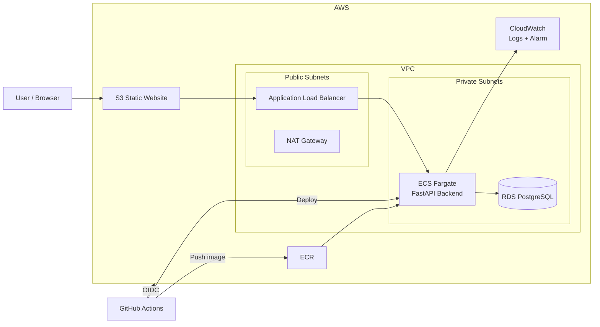

# Cloud / DevOps Engineer Technical Assessment

A reproducible AWS deployment of a simple three-tier web application using **Terraform**, **Docker**, **Amazon ECS Fargate**, **Amazon RDS PostgreSQL**, **Amazon S3**, **Amazon ECR**, **Amazon CloudWatch**, and **GitHub Actions**.

The application code is intentionally small. The main focus is the DevOps implementation: infrastructure automation, containerization, CI/CD, networking, security, monitoring, and documentation.

---

## Table of Contents

- [Architecture](#architecture)
- [Technology Stack](#technology-stack)
- [Repository Structure](#repository-structure)
- [Prerequisites](#prerequisites)
- [Run Locally](#run-locally)
- [Deploy to AWS](#deploy-to-aws)
- [CI/CD](#cicd)
- [Security](#security)
- [Monitoring and Logging](#monitoring-and-logging)
- [Architecture Decisions](#architecture-decisions)
- [Trade-offs](#trade-offs)
- [Production Considerations](#production-considerations)
- [Verification](#verification)
- [Cleanup](#cleanup)
- [Troubleshooting](#troubleshooting)

---

## Architecture



### Application traffic

```text
Browser
   |
   +--> Amazon S3 static frontend
                |
                v
      Application Load Balancer
                |
                v
          ECS Fargate
          FastAPI :8000
                |
                v
       RDS PostgreSQL :5432
```

### CI/CD flow

```text
Push to main
    |
    v
GitHub Actions
    |
    +--> Install dependencies
    +--> Run tests
    +--> Build Docker image
    +--> Authenticate to AWS with OIDC
    +--> Push image to ECR
    +--> Register new ECS task definition
    +--> Update ECS service
```

---

## Technology Stack

| Area | Technology |
|---|---|
| Cloud | AWS |
| IaC | Terraform |
| Frontend | HTML / JavaScript |
| Frontend Hosting | Amazon S3 Static Website |
| Backend | Python FastAPI |
| Database | PostgreSQL |
| Managed Database | Amazon RDS |
| Containers | Docker |
| Compute | Amazon ECS Fargate |
| Load Balancing | Application Load Balancer |
| Container Registry | Amazon ECR |
| CI/CD | GitHub Actions |
| GitHub → AWS Authentication | OpenID Connect (OIDC) |
| Logs | Amazon CloudWatch Logs |
| Monitoring / Alerting | Amazon CloudWatch |

---

## Why AWS?

AWS was selected because it provides managed services for every layer required by the solution and integrates well with Terraform and GitHub Actions.

The design intentionally uses managed services to reduce operational overhead:

- **ECS Fargate** removes the need to manage EC2 worker nodes.
- **RDS PostgreSQL** provides a managed relational database.
- **ECR** provides a private container registry.
- **ALB** provides traffic routing and health checks.
- **CloudWatch** provides centralized logs and monitoring.
- **S3** provides simple, low-cost static website hosting.

---

## Repository Structure

```text
.
├── .github/
│   └── workflows/
│       └── ci.yml
│
├── backend/
│   ├── app.py
│   ├── Dockerfile
│   ├── requirements.txt
│   ├── test_app.py
│   └── .dockerignore
│
├── frontend/
│   └── index.html
│
├── terraform/
│   ├── bootstrap/
│   │   ├── main.tf
│   │   ├── outputs.tf
│   │   ├── providers.tf
│   │   └── variables.tf
│   │
│   ├── environments/
│   │   └── assessment/
│   │       ├── backend.tf
│   │       ├── main.tf
│   │       ├── outputs.tf
│   │       ├── providers.tf
│   │       ├── variables.tf
│   │       └── terraform.tfvars.example
│   │
│   └── modules/
│       ├── cicd/
│       ├── ecr/
│       ├── ecs/
│       ├── frontend/
│       ├── monitoring/
│       ├── network/
│       └── rds/
│
├── docker-compose.yml
├── .gitignore
└── README.md
```

Terraform is split into reusable modules instead of placing all resources in one file.

---

# Prerequisites

Install the following before starting:

- Git
- Docker
- Docker Compose
- Terraform
- AWS CLI
- An AWS account
- A GitHub account

Verify the tools:

```bash
git --version
docker --version
docker compose version
terraform version
aws --version
```

Clone the repository:

```bash
git clone https://github.com/ahmedrabe33/cloud-devops-assessment.git
cd cloud-devops-assessment
```

---

# Run Locally

The local environment uses Docker Compose to run:

- FastAPI backend
- PostgreSQL database

## 1. Start the backend and database

From the repository root:

```bash
docker compose up --build
```

The backend will be available at:

```text
http://localhost:8000
```

Useful endpoints:

```text
GET  /
GET  /health
GET  /db-check
GET  /users
POST /users
```

Test the backend:

```bash
curl http://localhost:8000/health
```

Expected response:

```json
{"status":"healthy"}
```

Test database connectivity:

```bash
curl http://localhost:8000/db-check
```

## 2. Test the API

Create a user:

```bash
curl -X POST \
  http://localhost:8000/users \
  -H "Content-Type: application/json" \
  -d '{"name":"Test User","age":25}'
```

List users:

```bash
curl http://localhost:8000/users
```

## 3. Run the frontend locally

The cloud deployment replaces the `__API_URL__` placeholder automatically with the ALB URL.

For local testing, make a temporary local copy:

```bash
sed 's|__API_URL__|http://localhost:8000|g' \
  frontend/index.html > /tmp/index.html

cd /tmp
python3 -m http.server 8080
```

Open:

```text
http://localhost:8080
```

> This keeps the tracked `frontend/index.html` unchanged.

## 4. Stop the local environment

```bash
docker compose down
```

To also remove the local PostgreSQL volume:

```bash
docker compose down -v
```

---

# Docker

The FastAPI backend is containerized with a multi-stage Dockerfile.

The image follows basic container best practices:

- Multi-stage build
- `python:3.12-slim` base image
- Dependencies installed separately from application code
- Non-root runtime user
- `.dockerignore` to reduce build context
- Only the required application port exposed

Build manually if required:

```bash
docker build -t cloud-devops-backend ./backend
```

Run:

```bash
docker run --rm -p 8000:8000 cloud-devops-backend
```

---

# Deploy to AWS

## Important

Cloud infrastructure creates billable AWS resources such as:

- NAT Gateway
- Application Load Balancer
- ECS Fargate
- RDS

Destroy the environment when you finish testing.

---

## 1. Configure AWS credentials

Configure the AWS CLI using your own AWS account.

```bash
aws configure
```

Verify authentication:

```bash
aws sts get-caller-identity
```

Do not commit AWS access keys to Git.

---

## 2. Create the Terraform remote-state backend

The `terraform/bootstrap` directory creates the S3 bucket used for Terraform state.

```bash
cd terraform/bootstrap

terraform init
terraform fmt
terraform validate
terraform plan
terraform apply
```

View the outputs:

```bash
terraform output
```

### Important for another AWS account

S3 bucket names are globally unique.

If `terraform/environments/assessment/backend.tf` contains a bucket name from a different AWS account, replace it with the state bucket created by your bootstrap deployment.

Example:

```hcl
terraform {
  backend "s3" {
    bucket       = "YOUR-TERRAFORM-STATE-BUCKET"
    key          = "assessment/terraform.tfstate"
    region       = "us-east-1"
    encrypt      = true
    use_lockfile = true
  }
}
```

Do **not** commit secrets or Terraform state files.

---

## 3. Configure assessment variables

Move to the assessment environment:

```bash
cd ../environments/assessment
```

Review the example variables file:

```bash
cat terraform.tfvars.example
```

If the configuration expects a `.tfvars` file:

```bash
cp terraform.tfvars.example terraform.tfvars
```

Update values such as:

```text
AWS region
GitHub owner
GitHub repository
environment-specific values
```

Do not put the database password in a committed `.tfvars` file.

Provide it through an environment variable:

```bash
export TF_VAR_db_password='CHANGE_ME_TO_A_STRONG_PASSWORD'
```

---

## 4. Initialize Terraform

```bash
terraform init -reconfigure
```

Format and validate:

```bash
terraform fmt -recursive
terraform validate
```

Review the deployment:

```bash
terraform plan
```

---

## 5. Apply the infrastructure

```bash
terraform apply
```

Type:

```text
yes
```

when Terraform asks for confirmation.

After deployment:

```bash
terraform output
```

Typical outputs include:

```text
alb_dns_name
db_endpoint
ecr_repository_url
ecs_cluster_name
ecs_service_name
frontend_bucket_name
frontend_website_url
github_actions_role_arn
```

---

## First Deployment and ECR

The ECS task definition expects a backend image from ECR.

For a brand-new AWS account, the ECR repository is initially empty.

If the ECS service cannot start before the first image exists, use this bootstrap sequence:

1. Provision the infrastructure/ECR.
2. Configure GitHub OIDC as described below.
3. Push to `main` so GitHub Actions builds and pushes the first image.
4. Ensure the ECS service desired count is `1`.
5. Run `terraform apply` again if necessary.

After the first image is in ECR, normal deployments are automatic through GitHub Actions.

---

# CI/CD

The GitHub Actions workflow runs on pushes to the `main` branch.

The pipeline performs:

```text
Build
  |
  v
Test
  |
  v
Build Docker Image
  |
  v
Push to ECR
  |
  v
Deploy to ECS
```

## GitHub OIDC Setup

The project uses GitHub OpenID Connect instead of storing long-lived AWS credentials in GitHub.

Terraform creates:

- GitHub OIDC provider
- GitHub Actions IAM role
- Deployment permissions

Get the role ARN:

```bash
terraform output github_actions_role_arn
```

In GitHub:

```text
Repository
  -> Settings
  -> Secrets and variables
  -> Actions
  -> Variables
  -> New repository variable
```

Create:

```text
Name:  AWS_ROLE_ARN
Value: <github_actions_role_arn>
```

No AWS access key or secret access key is required by GitHub Actions.

## Trigger a deployment

Commit and push to `main`:

```bash
git add .
git commit -m "Trigger deployment"
git push origin main
```

Then open:

```text
GitHub repository -> Actions
```

A successful workflow should complete the test, Docker build, ECR push, and ECS deployment stages.

---

# Frontend Deployment

The frontend is deployed automatically by Terraform to an S3 static website bucket.

The tracked frontend contains:

```text
__API_URL__
```

Terraform replaces this placeholder with:

```text
http://<ALB-DNS>
```

before uploading the rendered `index.html` to S3.

Get the frontend URL:

```bash
terraform output -raw frontend_website_url
```

Open that URL in a browser.

---

# Networking

The VPC contains two public and two private subnets across multiple Availability Zones.

## Public subnets

Contain:

- Application Load Balancer
- NAT Gateway

## Private subnets

Contain:

- ECS Fargate tasks
- RDS PostgreSQL

The backend tasks do not receive public IP addresses.

RDS is not publicly accessible.

### Allowed traffic

```text
Internet
   |
   | TCP 80
   v
Application Load Balancer
   |
   | TCP 8000
   v
ECS Fargate
   |
   | TCP 5432
   v
RDS PostgreSQL
```

---

# Security

The solution applies basic security controls required for the assessment.

## IAM

Separate roles are used for:

- ECS task execution
- GitHub Actions deployment

GitHub Actions receives temporary AWS credentials through OIDC.

No long-lived AWS credentials are required in GitHub.

## Network isolation

- ECS runs in private subnets.
- RDS runs in private subnets.
- ECS does not receive a public IP.
- RDS public access is disabled.
- Only the ALB is exposed as the public backend entry point.

## Security groups

Only required traffic is allowed:

```text
Internet -> ALB : TCP 80
ALB -> ECS      : TCP 8000
ECS -> RDS      : TCP 5432
```

## Encryption

Encryption is enabled for:

- RDS storage
- S3 storage
- ECR
- Terraform remote state

## Secrets

The database password is supplied to Terraform through:

```text
TF_VAR_db_password
```

and is not committed to Git.

For a production environment, application/database secrets should be stored in AWS Secrets Manager or Systems Manager Parameter Store rather than passed as plain ECS environment variables.

---

# Monitoring and Logging

Amazon CloudWatch is used for centralized logs and monitoring.

## ECS logs

The backend sends container logs through the `awslogs` driver.

Log group:

```text
/ecs/cloud-devops-assessment-assessment
```

View recent logs:

```bash
aws logs tail \
  "/ecs/cloud-devops-assessment-assessment" \
  --since 10m \
  --region us-east-1
```

List log streams:

```bash
aws logs describe-log-streams \
  --log-group-name "/ecs/cloud-devops-assessment-assessment" \
  --order-by LastEventTime \
  --descending \
  --limit 5 \
  --region us-east-1
```

## CloudWatch alarm

Terraform creates an ECS CPU utilization alarm.

The example threshold is:

```text
CPUUtilization > 80%
```

Inspect the alarm:

```bash
aws cloudwatch describe-alarms \
  --alarm-names cloud-devops-assessment-assessment-ecs-cpu-high \
  --region us-east-1
```

---

# Architecture Decisions

## ECS Fargate instead of EC2

Fargate was selected to avoid managing container hosts.

Advantages:

- No EC2 operating-system administration
- No worker-node maintenance
- Native ECR integration
- Native ALB integration
- Native CloudWatch integration

Trade-off:

Fargate can be more expensive than an optimized EC2-based solution at larger scale.

## RDS instead of self-managed PostgreSQL

RDS was selected because it provides a managed database service with:

- Backups
- Encryption
- Managed maintenance
- VPC integration

## Private ECS and RDS

Both application compute and database resources are kept out of public subnets.

This limits the public attack surface.

## One NAT Gateway

The assessment uses one NAT Gateway to reduce cost.

Trade-off:

It creates an Availability Zone dependency for outbound traffic.

A production architecture would normally use a NAT Gateway per Availability Zone or redesign outbound connectivity using VPC endpoints where appropriate.

## S3 static website instead of CloudFront

CloudFront was considered for the frontend because it would provide:

- HTTPS
- CDN caching
- Better global delivery
- Private S3 origin access

During implementation, the AWS account used for the assessment was restricted from creating new CloudFront resources until account verification was completed.

For the assessment, S3 Static Website Hosting was used as a temporary alternative.

For production, CloudFront with a private S3 origin and HTTPS would be preferred.

---

# Trade-offs

The implementation was intentionally kept practical for a time-limited technical assessment.

Current trade-offs:

- Single NAT Gateway
- Single ECS task
- Single-AZ RDS
- S3 static website instead of CloudFront
- HTTP rather than custom-domain HTTPS
- Basic monitoring with one representative CPU alarm
- Small compute/database sizes to reduce temporary cloud cost

These decisions keep the environment simple and inexpensive while still demonstrating the required infrastructure and automation.

---

# Production Considerations

For production, the ECS service would run multiple tasks across multiple Availability Zones and use ECS Service Auto Scaling based on CPU, memory, or ALB request count.

RDS would use Multi-AZ deployment, stronger backup retention, deletion protection, and potentially read replicas depending on workload requirements.

The frontend would be placed behind CloudFront using a private S3 origin. HTTPS would be enforced using AWS Certificate Manager, and AWS WAF could be added where appropriate.

Secrets would be stored in AWS Secrets Manager or Systems Manager Parameter Store and rotated where possible.

Monitoring would be expanded to include ALB 5xx responses, latency, unhealthy targets, ECS CPU and memory, stopped tasks, RDS CPU, storage, database connections, and application-specific metrics.

Cost would be controlled through resource right-sizing, autoscaling, VPC endpoints where economical, appropriate log retention, AWS Budgets, and regular Cost Explorer reviews.

---

# Verification

## Application

Health:

```bash
curl http://<ALB-DNS>/health
```

Database connectivity:

```bash
curl http://<ALB-DNS>/db-check
```

Create user:

```bash
curl -X POST \
  http://<ALB-DNS>/users \
  -H "Content-Type: application/json" \
  -d '{"name":"Test User","age":25}'
```

List users:

```bash
curl http://<ALB-DNS>/users
```

## ECS

```bash
aws ecs describe-services \
  --cluster cloud-devops-assessment-assessment-cluster \
  --services cloud-devops-assessment-assessment-backend-service \
  --region us-east-1 \
  --query 'services[0].{Status:status,Desired:desiredCount,Running:runningCount,Pending:pendingCount}'
```

## Terraform

```bash
terraform state list
terraform output
```

## End-to-end validation performed

The deployed environment was tested successfully with:

```text
Frontend: Running
Backend API: Healthy
Database: Connected
```

The following flow was verified:

- S3 frontend loaded successfully
- Frontend reached the ALB
- ALB routed traffic to ECS
- FastAPI `/health` responded successfully
- FastAPI connected to RDS PostgreSQL
- User records could be inserted
- User records could be retrieved
- GitHub Actions tests passed
- Docker image was pushed to ECR
- GitHub Actions updated ECS successfully
- Terraform created and destroyed the environment

---

# Cleanup

The deployment does not need to remain running after testing.

From:

```bash
cd terraform/environments/assessment
```

run:

```bash
terraform destroy
```

Confirm with:

```text
yes
```

## ECR cleanup note

If Terraform reports that the ECR repository cannot be deleted because it still contains images:

```bash
aws ecr delete-repository \
  --repository-name cloud-devops-assessment-assessment-backend \
  --region us-east-1 \
  --force
```

Then run:

```bash
terraform destroy
```

again.

A better long-term Terraform configuration is to enable `force_delete = true` on the assessment ECR repository if automatic image cleanup is desired.

## Remote-state bucket

The Terraform remote-state bucket is managed separately under:

```text
terraform/bootstrap
```

It is intentionally not destroyed with the application environment.

---

# Troubleshooting

## Terraform state lock

Do not run multiple `terraform apply` or `terraform destroy` operations at the same time.

If Terraform reports a stale lock, first confirm that no Terraform process is still running.

Only then use the lock ID returned by Terraform:

```bash
terraform force-unlock <LOCK_ID>
```

Do not use `-lock=false` as a normal workaround.

## ECS task does not start

Check the service:

```bash
aws ecs describe-services \
  --cluster cloud-devops-assessment-assessment-cluster \
  --services cloud-devops-assessment-assessment-backend-service \
  --region us-east-1
```

Check CloudWatch logs:

```bash
aws logs tail \
  "/ecs/cloud-devops-assessment-assessment" \
  --since 10m \
  --region us-east-1
```

Check that an image exists in ECR:

```bash
aws ecr list-images \
  --repository-name cloud-devops-assessment-assessment-backend \
  --region us-east-1
```

## GitHub Actions cannot assume the AWS role

Check:

- `AWS_ROLE_ARN` exists in GitHub repository variables.
- The role ARN matches the Terraform output.
- The workflow runs from the expected repository.
- The workflow runs from the `main` branch.
- The OIDC trust policy matches the repository and branch.

## Database connection fails

Confirm:

- RDS is running.
- ECS and RDS are in the expected VPC.
- Port `5432` is allowed from the ECS security group to the RDS security group.
- The ECS task has the correct database environment variables.

---

# Evidence for Submission

Useful screenshots include:

1. Frontend showing **Frontend Running**
2. Backend showing **Healthy**
3. Database showing **Connected**
4. Successfully created user record
5. Successful GitHub Actions workflow
6. ECS service / running task
7. ECR image
8. CloudWatch logs
9. CloudWatch CPU alarm
10. Terraform apply or destroy result

The infrastructure can be destroyed after collecting the evidence to avoid unnecessary AWS cost.

---

# Assessment Coverage

This project demonstrates:

- Infrastructure as Code
- Modular Terraform design
- VPC and subnet configuration
- Managed PostgreSQL database
- Docker multi-stage build
- Non-root container execution
- Automated tests
- CI/CD deployment from `main`
- GitHub OIDC authentication
- Least-privilege IAM approach
- Private application/database networking
- Restricted security groups
- Encryption at rest
- Centralized logs
- CloudWatch monitoring
- Example alert
- Local run instructions
- Cloud deployment instructions
- Architecture decisions and rationale
- Time/cost trade-offs
- Production scale and high-availability considerations

---

## Author

**Ahmed Rabie**

Cloud / DevOps Engineer Technical Assessment
