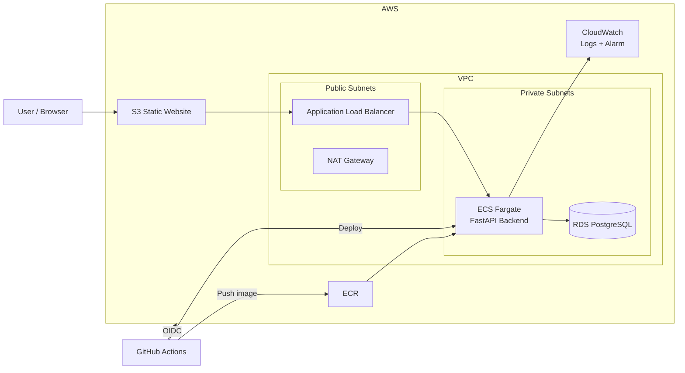

# Cloud / DevOps Engineer Technical Assessment

A reproducible AWS deployment of a simple three-tier web application using **Terraform**, **Docker**, **Amazon ECS Fargate**, **Amazon RDS PostgreSQL**, **Amazon S3**, **Amazon ECR**, **Amazon CloudWatch**, and **GitHub Actions**.

The application code is intentionally simple. The main focus of this project is the DevOps implementation: Infrastructure as Code, containerization, CI/CD, networking, security, monitoring, repeatability, and clear documentation.

---

## Table of Contents

- [Architecture](#architecture)
- [Technology Stack](#technology-stack)
- [Repository Structure](#repository-structure)
- [Prerequisites](#prerequisites)
- [Run Locally](#run-locally)
- [Reset Local Environment](#reset-local-environment)
- [Deploy to AWS from Zero](#deploy-to-aws-from-zero)
- [CI/CD](#cicd)
- [Security](#security)
- [Monitoring and Logging](#monitoring-and-logging)
- [Architecture Decisions](#architecture-decisions)
- [Trade-offs](#trade-offs)
- [Production Considerations](#production-considerations)
- [Verification](#verification)
- [Cleanup](#cleanup)
- [Troubleshooting](#troubleshooting)
- [Assessment Coverage](#assessment-coverage)

---

## Architecture



### Application Traffic

```text
Browser
   |
   +--> Amazon S3 Static Website
                |
                v
      Application Load Balancer
                |
                v
          ECS Fargate
          FastAPI :8000
                |
                v
       RDS PostgreSQL :5432
```

### CI/CD Flow

```text
Push to main
    |
    v
GitHub Actions
    |
    +--> Install dependencies
    +--> Run tests
    +--> Build Docker image
    +--> Authenticate to AWS using OIDC
    +--> Push image to ECR
    +--> Register new ECS task definition
    +--> Update ECS service
```

---

## Technology Stack

| Area | Technology |
|---|---|
| Cloud | AWS |
| Infrastructure as Code | Terraform |
| Frontend | HTML / JavaScript |
| Frontend Hosting | Amazon S3 Static Website |
| Backend | Python FastAPI |
| Database | PostgreSQL |
| Managed Database | Amazon RDS |
| Containers | Docker |
| Compute | Amazon ECS Fargate |
| Load Balancing | Application Load Balancer |
| Container Registry | Amazon ECR |
| CI/CD | GitHub Actions |
| GitHub → AWS Authentication | OpenID Connect (OIDC) |
| Logs | Amazon CloudWatch Logs |
| Monitoring / Alerting | Amazon CloudWatch |

---

## Why AWS?

AWS was selected because it provides managed services for every layer required by the solution and integrates well with Terraform and GitHub Actions.

The design intentionally uses managed services to reduce operational overhead:

- **ECS Fargate** removes the need to manage EC2 worker nodes.
- **RDS PostgreSQL** provides a managed relational database.
- **ECR** provides a private container registry.
- **ALB** provides traffic routing and health checks.
- **CloudWatch** provides centralized logs and monitoring.
- **S3** provides simple, low-cost static website hosting.

---

## Repository Structure

```text
.
├── .github/
│   └── workflows/
│       └── ci.yml
│
├── backend/
│   ├── app.py
│   ├── Dockerfile
│   ├── requirements.txt
│   ├── test_app.py
│   └── .dockerignore
│
├── frontend/
│   └── index.html
│
├── terraform/
│   ├── bootstrap/
│   │   ├── main.tf
│   │   ├── outputs.tf
│   │   ├── providers.tf
│   │   └── variables.tf
│   │
│   ├── environments/
│   │   └── assessment/
│   │       ├── backend.tf
│   │       ├── main.tf
│   │       ├── outputs.tf
│   │       ├── providers.tf
│   │       ├── variables.tf
│   │       └── terraform.tfvars.example
│   │
│   └── modules/
│       ├── cicd/
│       ├── ecr/
│       ├── ecs/
│       ├── frontend/
│       ├── monitoring/
│       ├── network/
│       └── rds/
│
├── docker-compose.yml
├── .gitignore
└── README.md
```

Terraform is split into reusable modules instead of placing the entire infrastructure in a single file.

---

# Prerequisites

Install:

- Git
- Docker
- Docker Compose
- Terraform
- AWS CLI
- An AWS account
- A GitHub account

Verify:

```bash
git --version
docker --version
docker compose version
terraform version
aws --version
```

Clone the repository:

```bash
git clone https://github.com/ahmedrabe33/cloud-devops-assessment.git
cd cloud-devops-assessment
```

---

# Run Locally

The local environment uses Docker Compose to run:

- FastAPI backend
- PostgreSQL database

## 1. Start Backend and Database

From the repository root:

```bash
docker compose up --build
```

The backend will be available at:

```text
http://localhost:8000
```

Useful endpoints:

```text
GET  /
GET  /health
GET  /db-check
GET  /users
POST /users
```

Test the backend:

```bash
curl http://localhost:8000/health
```

Expected response:

```json
{"status":"healthy"}
```

Test database connectivity:

```bash
curl http://localhost:8000/db-check
```

## 2. Test the API

Create a user:

```bash
curl -X POST \
  http://localhost:8000/users \
  -H "Content-Type: application/json" \
  -d '{"name":"Test User","age":25}'
```

List users:

```bash
curl http://localhost:8000/users
```

## 3. Run Frontend Locally

The cloud deployment uses the placeholder:

```text
__API_URL__
```

and Terraform replaces it with the ALB URL.

For local testing, create a temporary copy without changing the tracked file:

```bash
sed 's|__API_URL__|http://localhost:8000|g' \
  frontend/index.html > /tmp/index.html

cd /tmp
python3 -m http.server 8080
```

Open:

```text
http://localhost:8080
```

## 4. Stop Local Environment

From the project directory:

```bash
docker compose down
```

---

# Reset Local Environment

To completely remove the local containers, networks, and PostgreSQL data:

```bash
docker compose down -v --remove-orphans
```

Optional cleanup of the locally built backend image:

```bash
docker image rm cloud-devops-backend 2>/dev/null || true
```

Then start again from a clean local state:

```bash
docker compose up --build
```

---

# Docker Implementation

The backend is containerized using a multi-stage Dockerfile.

Implemented practices include:

- Multi-stage build
- `python:3.12-slim`
- Dependency installation separated from runtime code
- Non-root runtime user
- `.dockerignore`
- Minimal runtime image
- Application port `8000`

Manual build:

```bash
docker build -t cloud-devops-backend ./backend
```

---

# Deploy to AWS from Zero

This section describes a fresh deployment for a new user or a new AWS environment.

> AWS resources such as NAT Gateway, Application Load Balancer, ECS Fargate, and RDS may generate charges. Destroy the environment after testing if it is no longer needed.

---

## Step 1 — Configure AWS CLI

Configure credentials for your AWS account:

```bash
aws configure
```

Verify:

```bash
aws sts get-caller-identity
```

Do not commit AWS credentials to Git.

---

## Step 2 — Create Terraform Remote State

Go to the bootstrap directory:

```bash
cd terraform/bootstrap
```

Initialize and deploy:

```bash
terraform init
terraform fmt
terraform validate
terraform plan
terraform apply
```

Confirm with:

```text
yes
```

View outputs:

```bash
terraform output
```

The bootstrap configuration creates the S3 bucket used for Terraform remote state.

### Configure the backend bucket

Open:

```text
terraform/environments/assessment/backend.tf
```

Set the bucket to the S3 bucket created by the bootstrap step:

```hcl
terraform {
  backend "s3" {
    bucket       = "YOUR-TERRAFORM-STATE-BUCKET"
    key          = "assessment/terraform.tfstate"
    region       = "us-east-1"
    encrypt      = true
    use_lockfile = true
  }
}
```

S3 bucket names are globally unique, so another user should use the bucket created in their own AWS account.

---

## Step 3 — Configure Assessment Variables

Move to the assessment environment:

```bash
cd ../environments/assessment
```

Review:

```bash
cat terraform.tfvars.example
```

If required by the configuration:

```bash
cp terraform.tfvars.example terraform.tfvars
```

Update environment-specific values such as:

```text
AWS region
GitHub owner
GitHub repository
```

Do not put the database password in a committed `.tfvars` file.

Export it instead:

```bash
export TF_VAR_db_password='CHANGE_ME_TO_A_STRONG_PASSWORD'
```

---

## Step 4 — Initialize Terraform

```bash
terraform init -reconfigure
```

Format and validate:

```bash
terraform fmt -recursive
terraform validate
```

Review:

```bash
terraform plan
```

---

## Step 5 — First Infrastructure Deployment

The backend image does not exist in ECR on a completely fresh deployment.

The recommended bootstrap flow is:

1. Create the infrastructure with the ECS service temporarily set to `desired_count = 0`.
2. Push the first backend image through GitHub Actions.
3. Change ECS desired count to `1`.
4. Apply Terraform again.

Before the first apply, confirm that the ECS module is using:

```hcl
desired_count = 0
```

Then:

```bash
terraform apply
```

Confirm:

```text
yes
```

After the infrastructure is created:

```bash
terraform output
```

You should now have:

- ECR repository
- ECS cluster
- ALB
- RDS
- S3 frontend
- GitHub OIDC role
- CloudWatch resources

---

# CI/CD

The GitHub Actions workflow runs automatically when changes are pushed to `main`.

Pipeline flow:

```text
Build
  |
  v
Test
  |
  v
Build Docker Image
  |
  v
Push to ECR
  |
  v
Deploy to ECS
```

---

## Step 6 — Configure GitHub OIDC

Terraform creates the GitHub Actions IAM role.

Get the ARN:

```bash
terraform output -raw github_actions_role_arn
```

In GitHub:

```text
Repository
-> Settings
-> Secrets and variables
-> Actions
-> Variables
-> New repository variable
```

Create:

```text
Name: AWS_ROLE_ARN
Value: <terraform output>
```

The workflow uses OIDC temporary credentials, so no long-lived AWS access key or secret access key is required in GitHub.

---

## Step 7 — Build and Push the First Image

Push a commit to `main`:

```bash
cd ~/cloud-devops-assessment

git add .
git commit -m "Trigger initial deployment"
git push origin main
```

If there are no code changes, you can create an empty commit:

```bash
git commit --allow-empty -m "Trigger initial deployment"
git push origin main
```

Open:

```text
GitHub Repository
-> Actions
```

The workflow should:

1. Run tests
2. Build the Docker image
3. Authenticate to AWS using OIDC
4. Push the image to ECR
5. Run the deploy stage

At this point, the first image should exist in ECR.

Verify:

```bash
aws ecr list-images \
  --repository-name cloud-devops-assessment-assessment-backend \
  --region us-east-1
```

---

## Step 8 — Start the ECS Service

After the first image exists, change the ECS service desired count to:

```hcl
desired_count = 1
```

Then apply:

```bash
cd terraform/environments/assessment
terraform plan
terraform apply
```

Confirm:

```text
yes
```

Check the ECS service:

```bash
aws ecs describe-services \
  --cluster cloud-devops-assessment-assessment-cluster \
  --services cloud-devops-assessment-assessment-backend-service \
  --region us-east-1 \
  --query 'services[0].{Status:status,Desired:desiredCount,Running:runningCount,Pending:pendingCount}'
```

Expected steady state:

```text
Desired: 1
Running: 1
Pending: 0
```

---

## Step 9 — Get Deployment URLs

```bash
terraform output
```

Get the frontend URL:

```bash
terraform output -raw frontend_website_url
```

Get the backend ALB DNS:

```bash
terraform output -raw alb_dns_name
```

Open the frontend URL in a browser.

---

# Frontend Deployment

Terraform uploads `frontend/index.html` to Amazon S3.

The source file contains:

```text
__API_URL__
```

Terraform replaces this with:

```text
http://<ALB-DNS>
```

before uploading the final `index.html`.

This allows the same frontend source file to work with dynamically created AWS infrastructure.

---

# Networking

The VPC contains:

- Two public subnets
- Two private subnets
- Internet Gateway
- NAT Gateway

Public subnets contain:

- Application Load Balancer
- NAT Gateway

Private subnets contain:

- ECS Fargate
- RDS PostgreSQL

Traffic flow:

```text
Internet
   |
   | TCP 80
   v
Application Load Balancer
   |
   | TCP 8000
   v
ECS Fargate
   |
   | TCP 5432
   v
RDS PostgreSQL
```

---

# Security

## Private Resources

- ECS tasks are deployed in private subnets.
- ECS tasks do not receive public IP addresses.
- RDS is deployed in private subnets.
- RDS public access is disabled.

## Restricted Ports

Only required traffic is allowed:

```text
Internet -> ALB : TCP 80
ALB -> ECS      : TCP 8000
ECS -> RDS      : TCP 5432
```

## IAM

Separate IAM roles are used for:

- ECS task execution
- GitHub Actions

GitHub Actions permissions are limited to required deployment actions where possible.

## OIDC

GitHub Actions authenticates to AWS through:

```text
sts:AssumeRoleWithWebIdentity
```

This avoids storing permanent AWS credentials in GitHub.

## Encryption

Encryption is enabled for:

- RDS storage
- S3 objects
- ECR
- Terraform remote state

## Secrets

The database password is not committed to Git.

Terraform receives it through:

```text
TF_VAR_db_password
```

For production, runtime application secrets should be stored in AWS Secrets Manager or Systems Manager Parameter Store.

---

# Monitoring and Logging

Amazon CloudWatch is used for centralized logging and monitoring.

## Logs

ECS sends backend logs using the `awslogs` driver.

Log group:

```text
/ecs/cloud-devops-assessment-assessment
```

View logs:

```bash
aws logs tail \
  "/ecs/cloud-devops-assessment-assessment" \
  --since 10m \
  --region us-east-1
```

List recent streams:

```bash
aws logs describe-log-streams \
  --log-group-name "/ecs/cloud-devops-assessment-assessment" \
  --order-by LastEventTime \
  --descending \
  --limit 5 \
  --region us-east-1
```

## Alarm

Terraform creates a CloudWatch alarm for ECS CPU utilization.

Example threshold:

```text
CPUUtilization > 80%
```

Inspect it:

```bash
aws cloudwatch describe-alarms \
  --alarm-names cloud-devops-assessment-assessment-ecs-cpu-high \
  --region us-east-1
```

---

# Architecture Decisions

## ECS Fargate Instead of EC2

Fargate was selected to avoid managing EC2 container hosts.

Advantages:

- No OS administration
- No node maintenance
- Native ECR integration
- Native ALB integration
- Native CloudWatch integration

Trade-off:

Fargate may be more expensive than optimized EC2 workloads at larger scale.

## RDS Instead of Self-Managed PostgreSQL

RDS provides:

- Managed PostgreSQL
- Backups
- Encryption
- Reduced maintenance
- VPC integration

## Private ECS and RDS

The compute and database layers are not directly exposed to the internet.

## Single NAT Gateway

One NAT Gateway is used to reduce assessment cost.

Trade-off:

This creates an Availability Zone dependency.

For production, a NAT Gateway per Availability Zone or suitable VPC endpoints would improve resilience.

## S3 Static Website Instead of CloudFront

CloudFront was considered for:

- HTTPS
- CDN caching
- Better global delivery
- Private S3 origin access

During implementation, the AWS account used for the assessment was restricted from creating new CloudFront resources until account verification was completed.

Because CloudFront was not required by the assessment, S3 Static Website Hosting was used as a temporary alternative.

For production, CloudFront with a private S3 origin and HTTPS would be preferred.

---

# Trade-offs

The implementation was intentionally kept practical for a time-limited technical assessment.

Current trade-offs:

- One NAT Gateway
- One ECS task
- Single-AZ RDS
- S3 static website instead of CloudFront
- HTTP instead of custom-domain HTTPS
- Basic monitoring with one representative CPU alarm
- Small resource sizes to reduce temporary cloud cost

---

# Production Considerations

For production, the ECS service would run multiple tasks across multiple Availability Zones and use ECS Service Auto Scaling based on CPU, memory, or ALB request count.

RDS would use Multi-AZ deployment, stronger backup retention, deletion protection, automated snapshots, and potentially read replicas.

The frontend would use CloudFront with a private S3 origin and HTTPS through AWS Certificate Manager.

Secrets would be stored in AWS Secrets Manager or Systems Manager Parameter Store and rotated where appropriate.

Monitoring would be expanded to include:

- ALB 5xx errors
- Response latency
- Unhealthy targets
- ECS CPU
- ECS memory
- ECS task failures
- RDS CPU
- RDS connections
- RDS storage

Cost controls would include:

- ECS right-sizing
- Auto Scaling
- Database right-sizing
- CloudWatch log-retention tuning
- AWS Budgets
- Cost Explorer reviews
- Removal of unused resources

---

# Verification

## Backend Health

```bash
curl http://<ALB-DNS>/health
```

Expected:

```json
{"status":"healthy"}
```

## Database Connectivity

```bash
curl http://<ALB-DNS>/db-check
```

## Create User

```bash
curl -X POST \
  http://<ALB-DNS>/users \
  -H "Content-Type: application/json" \
  -d '{"name":"Test User","age":25}'
```

## List Users

```bash
curl http://<ALB-DNS>/users
```

## ECS

```bash
aws ecs describe-services \
  --cluster cloud-devops-assessment-assessment-cluster \
  --services cloud-devops-assessment-assessment-backend-service \
  --region us-east-1 \
  --query 'services[0].{Status:status,Desired:desiredCount,Running:runningCount,Pending:pendingCount}'
```

## ECR

```bash
aws ecr list-images \
  --repository-name cloud-devops-assessment-assessment-backend \
  --region us-east-1
```

## Terraform

```bash
terraform state list
terraform output
```

## End-to-End Validation

The deployment was successfully validated with:

```text
Frontend: Running
Backend API: Healthy
Database: Connected
```

The following flow was verified:

- S3 frontend loaded successfully
- Frontend reached the ALB
- ALB routed requests to ECS
- FastAPI health check succeeded
- Backend connected to RDS
- User records could be inserted
- User records could be retrieved
- GitHub Actions tests passed
- Docker image was pushed to ECR
- GitHub Actions deployment completed successfully
- Terraform created the environment

---

# Cleanup

## Remove AWS Assessment Infrastructure

Go to:

```bash
cd terraform/environments/assessment
```

Export the same database variable if Terraform requires it:

```bash
export TF_VAR_db_password='YOUR_DATABASE_PASSWORD'
```

Destroy:

```bash
terraform destroy
```

Confirm:

```text
yes
```

## ECR Repository Contains Images

If Terraform reports:

```text
RepositoryNotEmptyException
```

delete the repository and its images:

```bash
aws ecr delete-repository \
  --repository-name cloud-devops-assessment-assessment-backend \
  --region us-east-1 \
  --force
```

Then run:

```bash
terraform destroy
```

again.

Alternatively, for an assessment environment, the ECR resource can be configured with:

```hcl
force_delete = true
```

to allow Terraform to remove the repository together with its images.

## Verify Complete Cleanup

```bash
terraform state list
```

If the command returns no managed assessment resources, the main environment has been removed.

## Terraform Remote State

The remote-state bucket is managed separately under:

```text
terraform/bootstrap
```

Do not destroy it together with the main environment unless you intentionally want to remove the Terraform backend as well.

---

# Troubleshooting

## Terraform State Lock

Do not run multiple Terraform operations at the same time.

If a stale lock remains after confirming no Terraform process is running:

```bash
terraform force-unlock <LOCK_ID>
```

Do not use `-lock=false` as a normal workaround.

## ECS Does Not Start

Check the service:

```bash
aws ecs describe-services \
  --cluster cloud-devops-assessment-assessment-cluster \
  --services cloud-devops-assessment-assessment-backend-service \
  --region us-east-1
```

Check logs:

```bash
aws logs tail \
  "/ecs/cloud-devops-assessment-assessment" \
  --since 10m \
  --region us-east-1
```

Check ECR:

```bash
aws ecr list-images \
  --repository-name cloud-devops-assessment-assessment-backend \
  --region us-east-1
```

## GitHub Actions Cannot Assume AWS Role

Check:

- `AWS_ROLE_ARN` exists in GitHub repository variables.
- The role ARN matches the Terraform output.
- The workflow is running from the expected repository.
- The workflow is running from `main`.
- The OIDC trust policy matches the repository and branch.

## Database Connection Fails

Check:

- RDS is available.
- ECS and RDS are in the same expected VPC.
- RDS security group allows port `5432` from the ECS security group.
- ECS has the correct database environment variables.

---

# Evidence for Submission

Useful screenshots include:

1. Frontend showing **Frontend Running**
2. Backend showing **Healthy**
3. Database showing **Connected**
4. Successfully created user
5. Successful GitHub Actions workflow
6. ECS running task
7. ECR image
8. CloudWatch logs
9. CloudWatch CPU alarm
10. Terraform apply or destroy output

The environment can be destroyed after collecting evidence to avoid unnecessary AWS cost.

---

# Assessment Coverage

This project demonstrates:

- Infrastructure as Code
- Modular Terraform structure
- Compute, networking, and managed database
- Naming and tagging
- Docker containerization
- Multi-stage build
- Non-root container execution
- Automated tests
- CI/CD on `main`
- Automatic Docker build and deployment
- GitHub OIDC authentication
- Least-privilege IAM approach
- Restricted network access
- Encryption
- CloudWatch logging
- CloudWatch monitoring
- Example alert
- Local run instructions
- Cloud deployment instructions
- Architecture diagram
- Architecture rationale
- Trade-offs
- Production scale, cost, and high-availability considerations

---

## Author

**Ahmed Rabie**

Cloud / DevOps Engineer Technical Assessment
