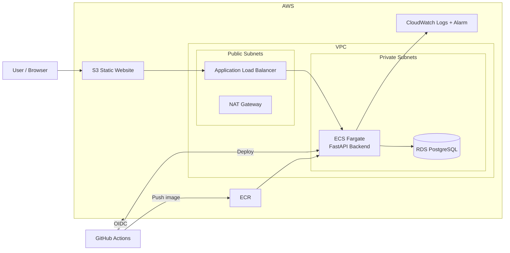
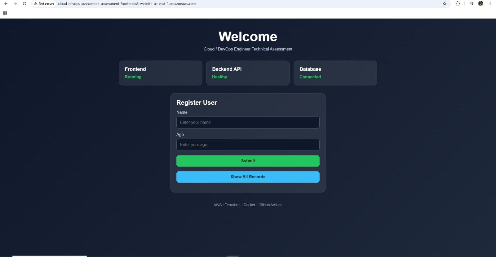
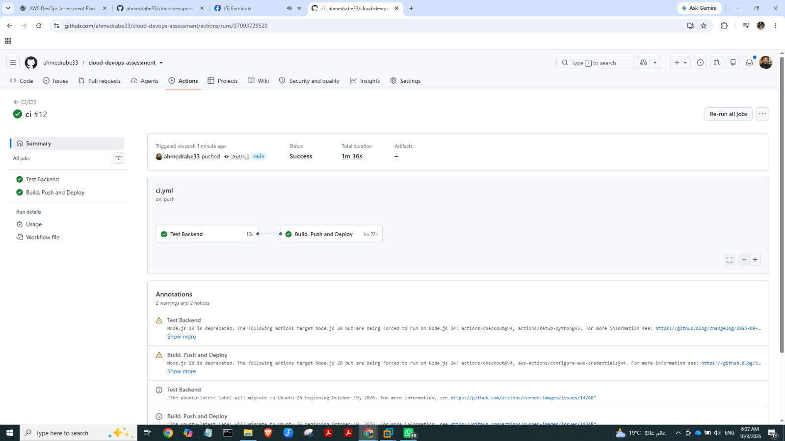
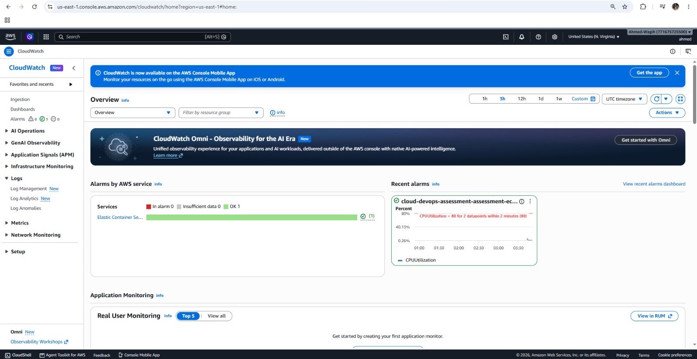
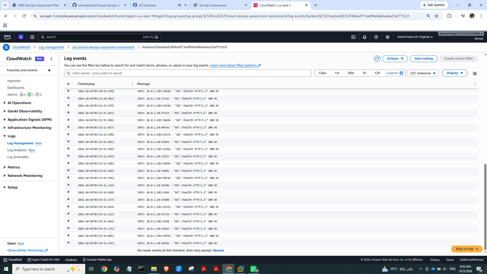
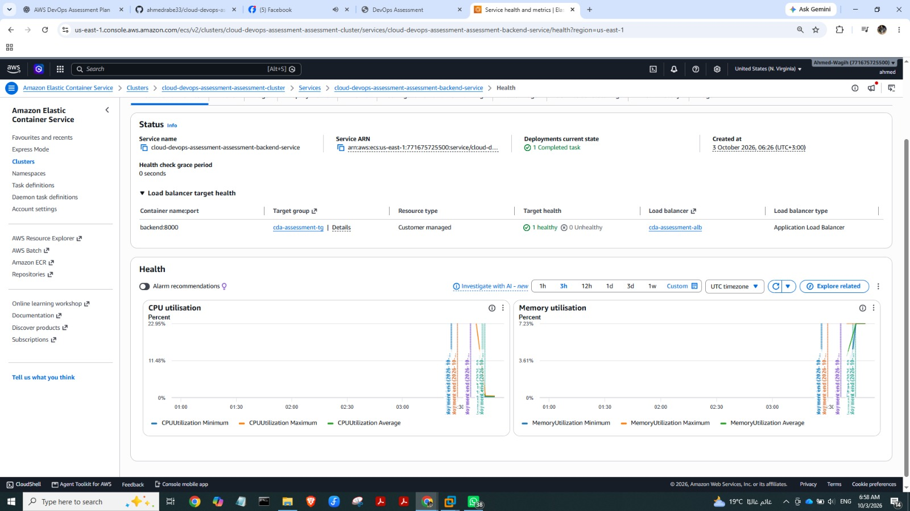

# Cloud / DevOps Engineer Technical Assessment

A reproducible AWS deployment of a simple three-tier web application using **Terraform**, **Docker**, **Amazon ECS Fargate**, **Amazon RDS PostgreSQL**, **Amazon S3**, **Amazon ECR**, **Amazon CloudWatch**, and **GitHub Actions**.

The application itself is intentionally simple. The main focus is the DevOps implementation: Infrastructure as Code, containerization, CI/CD, networking, security, monitoring, repeatability, and documentation.

---

## Table of Contents

- [Architecture](#architecture)
- [Technology Stack](#technology-stack)
- [Repository Structure](#repository-structure)
- [Prerequisites](#prerequisites)
- [Clone the Repository](#clone-the-repository)
- [Run Locally](#run-locally)
- [Reset Local Environment](#reset-local-environment)
- [Deploy to AWS from Zero](#deploy-to-aws-from-zero)
- [CI/CD](#cicd)
- [Security](#security)
- [Monitoring and Logging](#monitoring-and-logging)
- [Verification](#verification)
- [Deployment Evidence](#deployment-evidence)
- [Architecture Decisions](#architecture-decisions)
- [Trade-offs](#trade-offs)
- [Production Considerations](#production-considerations)
- [Cleanup](#cleanup)
- [Troubleshooting](#troubleshooting)
- [Assessment Coverage](#assessment-coverage)

---

# Architecture



## Application Traffic

```text
Browser
   |
   v
Amazon S3 Static Website
   |
   v
Application Load Balancer :80
   |
   v
ECS Fargate / FastAPI :8000
   |
   v
RDS PostgreSQL :5432
```

## CI/CD Flow

```text
Push to main
    |
    v
Test Backend
    |
    v
Build Docker Image once
    |
    v
Authenticate to AWS using OIDC
    |
    v
Push image to ECR
    |
    v
Register new ECS task definition
    |
    v
Deploy ECS service
```

Pull requests run the backend test job only. AWS deployment runs only for pushes to `main`.

---

# Technology Stack

| Area | Technology |
|---|---|
| Cloud | AWS |
| Infrastructure as Code | Terraform |
| Frontend | HTML / JavaScript |
| Frontend Hosting | Amazon S3 Static Website |
| Backend | Python FastAPI |
| Database | PostgreSQL |
| Managed Database | Amazon RDS |
| Containers | Docker |
| Compute | Amazon ECS Fargate |
| Load Balancing | Application Load Balancer |
| Container Registry | Amazon ECR |
| CI/CD | GitHub Actions |
| GitHub → AWS Authentication | OpenID Connect (OIDC) |
| Logs | Amazon CloudWatch Logs |
| Monitoring / Alerting | Amazon CloudWatch |

---

# Why AWS?

AWS was selected because it provides managed services for all required layers and integrates well with Terraform and GitHub Actions.

- **ECS Fargate** avoids managing EC2 container hosts.
- **RDS PostgreSQL** provides a managed relational database.
- **ECR** provides a private container registry.
- **ALB** provides routing and health checks.
- **CloudWatch** provides centralized logging and monitoring.
- **S3** provides simple and low-cost static frontend hosting.

---

# Repository Structure

```text
.
├── .github/
│   └── workflows/
│       └── ci.yml
├── backend/
│   ├── app.py
│   ├── Dockerfile
│   ├── requirements.txt
│   ├── test_app.py
│   └── .dockerignore
├── frontend/
│   └── index.html
├── images/
│   └── deployment screenshots
├── terraform/
│   ├── bootstrap/
│   │   ├── main.tf
│   │   ├── outputs.tf
│   │   ├── providers.tf
│   │   └── variables.tf
│   ├── environments/
│   │   └── assessment/
│   │       ├── backend.tf
│   │       ├── main.tf
│   │       ├── outputs.tf
│   │       ├── providers.tf
│   │       ├── variables.tf
│   │       └── terraform.tfvars.example
│   └── modules/
│       ├── cicd/
│       ├── ecr/
│       ├── ecs/
│       ├── frontend/
│       ├── monitoring/
│       ├── network/
│       └── rds/
├── docker-compose.yml
├── .gitignore
└── README.md
```

Terraform is organized into reusable modules instead of placing the whole infrastructure in one file.

---

# Prerequisites

Install:

- Git
- Docker
- Docker Compose
- Terraform
- AWS CLI
- An AWS account
- A GitHub account

Verify:

```bash
git --version
docker --version
docker compose version
terraform version
aws --version
```

---

# Clone the Repository

Clone from any directory:

```bash
git clone https://github.com/ahmedrabe33/cloud-devops-assessment.git
cd cloud-devops-assessment
```

Set a reusable repository-root variable:

```bash
REPO_ROOT="$(git rev-parse --show-toplevel)"
```

Return to the repository root at any time:

```bash
cd "$REPO_ROOT"
```

This avoids assuming the project was cloned directly under `~/`.

---

# Run Locally

The local environment runs the FastAPI backend and PostgreSQL through Docker Compose.

## 1. Start Backend and Database

```bash
REPO_ROOT="$(git rev-parse --show-toplevel)"
cd "$REPO_ROOT"

docker compose up --build
```

Backend:

```text
http://localhost:8000
```

Useful endpoints:

```text
GET  /
GET  /health
GET  /db-check
GET  /users
POST /users
```

In another terminal:

```bash
curl http://localhost:8000/health
```

Expected:

```json
{"status":"healthy"}
```

Database connectivity:

```bash
curl http://localhost:8000/db-check
```

## 2. Test the API

Create a user:

```bash
curl -X POST   http://localhost:8000/users   -H "Content-Type: application/json"   -d '{"name":"Test User","age":25}'
```

List users:

```bash
curl http://localhost:8000/users
```

## 3. Run Frontend Locally

The tracked cloud frontend contains the placeholder:

```text
__API_URL__
```

For local testing, create a temporary copy pointing to the local backend:

```bash
REPO_ROOT="$(git rev-parse --show-toplevel)"

sed 's|__API_URL__|http://localhost:8000|g'   "$REPO_ROOT/frontend/index.html" > /tmp/index.html
```

Start a local web server:

```bash
cd /tmp
python3 -m http.server 8080
```

Open:

```text
http://localhost:8080
```

## 4. Stop Local Environment

Stop the frontend server with `Ctrl + C`, then return to the repository:

```bash
cd -
REPO_ROOT="$(git rev-parse --show-toplevel)"
cd "$REPO_ROOT"
```

Stop Docker Compose:

```bash
docker compose down
```

---

# Reset Local Environment

Remove local containers, Compose networks, and PostgreSQL data:

```bash
REPO_ROOT="$(git rev-parse --show-toplevel)"
cd "$REPO_ROOT"

docker compose down -v --remove-orphans
```

Start again from a clean state:

```bash
docker compose up --build
```

---

# Docker Implementation

The backend uses a multi-stage Dockerfile with:

- `python:3.12-slim`
- Multi-stage build
- Non-root runtime user
- `.dockerignore`
- Minimal runtime image
- Port `8000`

Manual build:

```bash
REPO_ROOT="$(git rev-parse --show-toplevel)"
cd "$REPO_ROOT"

docker build -t cloud-devops-backend ./backend
```

---

# Deploy to AWS from Zero

> AWS resources such as NAT Gateway, ALB, ECS Fargate, and RDS can generate charges. Destroy the environment after testing if it is no longer required.

Start from the repository root:

```bash
REPO_ROOT="$(git rev-parse --show-toplevel)"
cd "$REPO_ROOT"
```

## Step 1 — Configure AWS CLI

```bash
aws configure
aws sts get-caller-identity
```

Never commit AWS credentials to Git.

## Step 2 — Create Terraform Remote State

```bash
cd "$REPO_ROOT/terraform/bootstrap"

terraform init
terraform fmt
terraform validate
terraform plan
terraform apply
```

Confirm with:

```text
yes
```

Get the created state bucket:

```bash
terraform output -raw terraform_state_bucket
```

Edit:

```text
terraform/environments/assessment/backend.tf
```

and set the bucket to the value returned above:

```hcl
terraform {
  backend "s3" {
    bucket       = "YOUR-TERRAFORM-STATE-BUCKET"
    key          = "assessment/terraform.tfstate"
    region       = "us-east-1"
    encrypt      = true
    use_lockfile = true
  }
}
```

## Step 3 — Configure Assessment Variables

```bash
cd "$REPO_ROOT/terraform/environments/assessment"

cat terraform.tfvars.example
cp terraform.tfvars.example terraform.tfvars
```

Update environment-specific values such as AWS region, GitHub owner, and repository if required.

Do not commit the database password. Export it instead:

```bash
export TF_VAR_db_password='CHANGE_ME_TO_A_STRONG_PASSWORD'
```

## Step 4 — Initialize the Assessment Environment

```bash
terraform init -reconfigure
terraform fmt -recursive
terraform validate
```

## Step 5 — First Apply with ECS Desired Count 0

A fresh ECR repository contains no backend image yet.

Temporarily set the ECS desired-count default to `0`:

```bash
cd "$REPO_ROOT"

sed -i 's/default = 1/default = 0/' terraform/modules/ecs/variables.tf
```

Verify:

```bash
grep -n "default = " terraform/modules/ecs/variables.tf
```

Apply:

```bash
cd "$REPO_ROOT/terraform/environments/assessment"

terraform plan
terraform apply
```

Confirm with:

```text
yes
```

At this point the infrastructure exists, but the backend task is intentionally not running yet.

---

# CI/CD

The workflow has two jobs:

```text
Test Backend
     |
     v
Build, Push and Deploy
```

The Docker image is built **once** after tests pass.

For pushes to `main`, the deployment job:

1. Authenticates to AWS using OIDC.
2. Logs in to ECR.
3. Builds the Docker image once.
4. Tags it with the Git commit SHA and `latest`.
5. Pushes both tags to ECR.
6. Downloads the current ECS task definition.
7. Renders a new task-definition revision with the SHA-tagged image.
8. Deploys the ECS service.

OIDC permission is limited to the deploy job:

```yaml
permissions:
  contents: read
  id-token: write
```

## Step 6 — Configure GitHub OIDC

```bash
cd "$REPO_ROOT/terraform/environments/assessment"

terraform output -raw github_actions_role_arn
```

In GitHub:

```text
Repository
-> Settings
-> Secrets and variables
-> Actions
-> Variables
-> New repository variable
```

Create:

```text
Name: AWS_ROLE_ARN
Value: <terraform output>
```

No long-lived AWS access key or secret access key is stored in GitHub.

## Step 7 — Build and Push the First Image

Trigger the workflow:

```bash
cd "$REPO_ROOT"

git commit --allow-empty -m "Trigger initial deployment"
git push origin main
```

Verify ECR afterward:

```bash
aws ecr list-images   --repository-name cloud-devops-assessment-assessment-backend   --region us-east-1
```

## Step 8 — Set ECS Desired Count to 1

After the first image exists in ECR:

```bash
cd "$REPO_ROOT"

sed -i 's/default = 0/default = 1/' terraform/modules/ecs/variables.tf
```

Verify:

```bash
grep -n "default = " terraform/modules/ecs/variables.tf
```

Apply:

```bash
cd "$REPO_ROOT/terraform/environments/assessment"

terraform plan
terraform apply
```

Check service state:

```bash
aws ecs describe-services   --cluster cloud-devops-assessment-assessment-cluster   --services cloud-devops-assessment-assessment-backend-service   --region us-east-1   --query 'services[0].{Status:status,Desired:desiredCount,Running:runningCount,Pending:pendingCount}'
```

Expected steady state:

```text
Status: ACTIVE
Desired: 1
Running: 1
Pending: 0
```

During a rolling deployment, ECS may temporarily run more than one task.

## Step 9 — Get Deployment URLs

```bash
cd "$REPO_ROOT/terraform/environments/assessment"

terraform output
terraform output -raw frontend_website_url
terraform output -raw alb_dns_name
```

Open the frontend URL in a browser.

---

# Frontend Deployment

Terraform uploads `frontend/index.html` to S3.

The source contains:

```text
__API_URL__
```

Terraform replaces it with:

```text
http://<ALB-DNS>
```

before uploading the rendered file.

---

# Networking

The VPC contains:

- Two public subnets
- Two private subnets
- Internet Gateway
- NAT Gateway

Traffic:

```text
Internet -> ALB : TCP 80
ALB -> ECS      : TCP 8000
ECS -> RDS      : TCP 5432
```

ECS and RDS are private. Only the ALB is a public backend entry point.

---

# Security

## IAM and OIDC

Separate IAM roles are used for ECS task execution and GitHub Actions deployment.

GitHub Actions authenticates through:

```text
sts:AssumeRoleWithWebIdentity
```

No long-lived AWS credentials are required in GitHub.

## Network Isolation

- ECS tasks run in private subnets.
- ECS tasks have no public IP.
- RDS runs in private subnets.
- RDS public access is disabled.

## Encryption

Encryption is enabled for:

- RDS storage
- S3 storage
- ECR
- Terraform remote state

## Secrets

The database password is not committed to Git and is supplied through:

```text
TF_VAR_db_password
```

For production, runtime secrets should be stored in AWS Secrets Manager or Systems Manager Parameter Store.

## HTTPS

The assessment deployment uses HTTP because the AWS account used during implementation was restricted from creating new CloudFront resources until account verification was completed.

For production, the frontend would use CloudFront with a private S3 origin and HTTPS, and the ALB would use an ACM certificate with an HTTPS listener.

---

# Monitoring and Logging

Amazon CloudWatch provides centralized logs, ECS metrics, and an example alert.

## CloudWatch Logs

ECS sends backend logs using the `awslogs` driver.

Log group:

```text
/ecs/cloud-devops-assessment-assessment
```

View recent logs:

```bash
aws logs tail   "/ecs/cloud-devops-assessment-assessment"   --since 10m   --region us-east-1
```

The logs include successful ALB health-check requests such as:

```text
GET /health HTTP/1.1 200 OK
```

## CloudWatch Alarm

Terraform creates:

```text
cloud-devops-assessment-assessment-ecs-cpu-high
```

with the example condition:

```text
ECS CPUUtilization > 80%
```

Inspect it:

```bash
aws cloudwatch describe-alarms   --alarm-names cloud-devops-assessment-assessment-ecs-cpu-high   --region us-east-1
```

When the configured threshold is breached for the evaluation period, the alarm changes from `OK` to `ALARM`.

The assessment uses this as the required example alert. No automatic action is attached. In production it could notify SNS and/or complement ECS Service Auto Scaling.

---

# Verification

```bash
cd "$REPO_ROOT/terraform/environments/assessment"

ALB_DNS="$(terraform output -raw alb_dns_name)"
```

Backend health:

```bash
curl "http://$ALB_DNS/health"
```

Database:

```bash
curl "http://$ALB_DNS/db-check"
```

Create user:

```bash
curl -X POST   "http://$ALB_DNS/users"   -H "Content-Type: application/json"   -d '{"name":"Test User","age":25}'
```

List users:

```bash
curl "http://$ALB_DNS/users"
```

End-to-end validation completed successfully with:

```text
Frontend: Running
Backend API: Healthy
Database: Connected
```

The deployment also verified:

- ALB target healthy
- ECS task running
- RDS connectivity
- GitHub Actions success
- ECR image push
- CloudWatch application logs
- CloudWatch CPU alarm

---

# Deployment Evidence

Store screenshots under:

```text
images/
```

Recommended filenames:

```text
images/
├── application-health.png
├── github-actions.png
├── cloudwatch-alarm.png
├── cloudwatch-logs.png
└── ecs-health.png
```

Then the screenshots can render directly in GitHub:

### Application



### GitHub Actions



### CloudWatch Alarm



### CloudWatch Logs



### ECS Health and Metrics



---

# Architecture Decisions

## ECS Fargate Instead of EC2

Fargate reduces infrastructure management and integrates directly with ECR, ALB, IAM, and CloudWatch.

**Trade-off:** at larger scale, optimized EC2 capacity may be cheaper.

## RDS Instead of Self-Managed PostgreSQL

RDS provides managed PostgreSQL, backups, encryption, and reduced database administration.

## Private ECS and RDS

Compute and database resources are not directly exposed to the internet.

## Single NAT Gateway

A single NAT Gateway reduces assessment cost.

**Trade-off:** it creates an Availability Zone dependency for outbound traffic.

## S3 Static Website Instead of CloudFront

CloudFront was considered for HTTPS, CDN caching, global delivery, and private S3 origin access. The AWS account used during the assessment was restricted from creating CloudFront resources until account verification was completed, so S3 Static Website Hosting was used as a practical temporary alternative.

---

# Trade-offs

The assessment environment intentionally favors simplicity and low temporary cost:

- One NAT Gateway
- One ECS task
- Single-AZ RDS
- S3 static website instead of CloudFront
- HTTP instead of custom-domain HTTPS
- One representative CloudWatch CPU alarm
- Small compute/database sizes

---

# Production Considerations

For production, ECS would run multiple tasks across Availability Zones with ECS Service Auto Scaling based on CPU, memory, or ALB request count. RDS would use Multi-AZ, longer backup retention, deletion protection, and possibly read replicas. The frontend would use CloudFront with a private S3 origin and HTTPS through ACM, while the ALB would also use HTTPS. Secrets would move to Secrets Manager or Parameter Store. Monitoring would expand to ALB 5xx/latency, unhealthy targets, ECS CPU/memory/task failures, and RDS CPU/storage/connections. High availability would also use NAT redundancy or suitable VPC endpoints. Cost would be controlled through right-sizing, autoscaling, log-retention tuning, AWS Budgets, and regular Cost Explorer reviews.

---

# Cleanup

## Remove Local Environment

```bash
REPO_ROOT="$(git rev-parse --show-toplevel)"
cd "$REPO_ROOT"

docker compose down -v --remove-orphans
```

## Remove AWS Assessment Infrastructure

```bash
cd "$REPO_ROOT/terraform/environments/assessment"

export TF_VAR_db_password='YOUR_DATABASE_PASSWORD'
terraform destroy
```

## ECR Repository Contains Images

If Terraform reports `RepositoryNotEmptyException`:

```bash
aws ecr delete-repository   --repository-name cloud-devops-assessment-assessment-backend   --region us-east-1   --force
```

Then:

```bash
terraform destroy
```

again.

## Verify Cleanup

```bash
terraform state list
```

If no assessment resources are returned, the main environment has been removed.

The remote-state bucket is managed separately under:

```text
terraform/bootstrap
```

---

# Troubleshooting

## Repository Location

From any subdirectory inside the repository:

```bash
REPO_ROOT="$(git rev-parse --show-toplevel)"
cd "$REPO_ROOT"
```

## Terraform State Lock

Do not run multiple Terraform operations concurrently.

For a stale lock, after confirming no Terraform process is still running:

```bash
terraform force-unlock <LOCK_ID>
```

## ECS Does Not Start

Check ECS:

```bash
aws ecs describe-services   --cluster cloud-devops-assessment-assessment-cluster   --services cloud-devops-assessment-assessment-backend-service   --region us-east-1
```

Check ECR:

```bash
aws ecr list-images   --repository-name cloud-devops-assessment-assessment-backend   --region us-east-1
```

Check logs:

```bash
aws logs tail   "/ecs/cloud-devops-assessment-assessment"   --since 10m   --region us-east-1
```

## GitHub Actions Cannot Assume the AWS Role

Check that:

- `AWS_ROLE_ARN` exists in repository variables.
- The role ARN matches Terraform output.
- The workflow is running from the correct repository.
- Deployment is triggered from `main`.
- The OIDC trust policy matches the repository and branch.

---

# Assessment Coverage

This project demonstrates:

- Infrastructure as Code
- Modular Terraform organization
- AWS compute, networking, and managed database
- Naming and tagging
- Terraform remote state and locking
- Docker multi-stage build
- Non-root container execution
- Automated backend tests
- CI/CD on `main`
- Single Docker build per deployment
- ECR image publishing
- ECS automated deployment
- GitHub OIDC authentication
- Least-privilege IAM approach
- Restricted network access
- Encryption at rest
- CloudWatch logging
- CloudWatch monitoring
- Example CPU alert
- Local run and reset instructions
- Fresh AWS deployment instructions
- Path-independent repository instructions
- Architecture diagram
- Architecture rationale
- Trade-offs
- Production scale, cost, and high-availability considerations

---

# Author

**Ahmed Rabie**

Cloud / DevOps Engineer Technical Assessment
